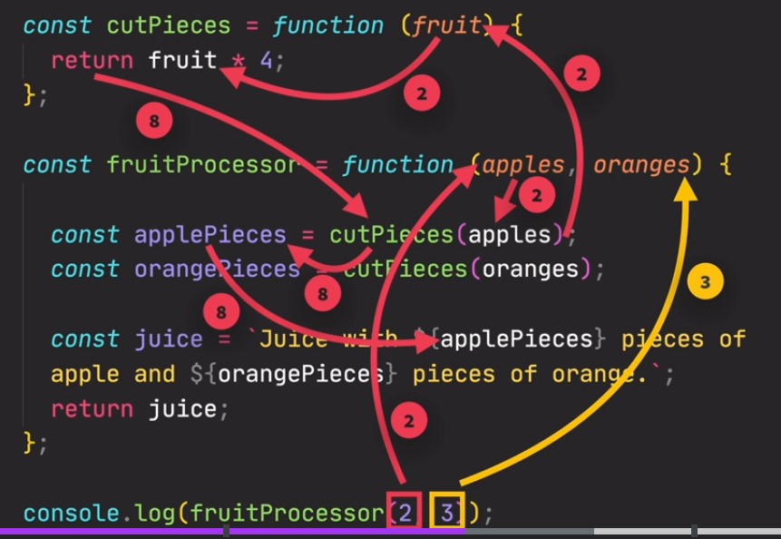

# Complete JS Documentation

<a name='top'></a>
<kbd>**JS Fundamental Contents**</kbd>

_Please click to go to topic >>>>>_

1. [Statement and Comments](#Statement)
1. [Details about variable](#variable)
1. [Concatenation](#Concatenation)
1. [Data types](#dataTypes)
1. [Operators](#operator)
1. [Conditional Statement](#statement)
1. [function](#functiontutorial)
1. [Loop in JS](#loop)

<a name='topAdv'></a>
<kbd>**JS Advanced Level Contents**</kbd>

_Please click to go to topic>>>>>_

1. [Scope in JS](#scope)
1. [JS String](#advanceString)
1. [JS Array](#array)
1. [JS Object](#object)
1. [`'this'` keyword in JS](#thisKeyword)
1. [The Spread Operator](#spreadOperator)
1. [Type Conversion/coercion](#coercion1)
1. [Advanced function](#functionAdv)
1. [Document Object Model](#dom)

<kbd>**JS Fundamental Topics Details**</kbd>

_Please click for open details topic>>>>>_
<a name='Statement'></a>

<details>
<summary> Statement and Comments</summary>
<h1> Statement and comments </h1>

> **_Statement_**

Statement is a command. After complete command use (;). In below two variable is seperate statement.

### Example:

```js
var name;
let age;
```

> **_Comments_**

In JavaScript, comments can be added using either double slashes (//) or a forward slash followed by an asterisk (/_) and an asterisk followed by a forward slash (_/).

Single-line comments, which are ignored by the JavaScript interpreter, can be added using double slashes:

`// This is a single-line comment`

Multi-line comments, which can span multiple lines and are also ignored by the interpreter, can be added using forward slash and asterisk:

```js
/* This is a
multi-line comment */
```

[Go to top:arrow_up: ](#top)

</details>

<a name='variable'></a>

<details>
<h1>Details about variable </h1>
    <summary>Details about variable</summary>

<button style='padding:3px; font-size:16px'>Learning summary</button>

- what is variable.
- Declaration of variable.
- Rules of assigning variable name.
- Assign value in variable.
- System of Re-assign value.
- Difference between var, let and const.
- Local and Global variable/scope.

> **_What is Variable?_**

Variable is a Container which store data.

> **_Declaration of Variable_**

By three keyword declare variable.

- var
- let
- const

### Example of declare variable

```js
var name;
let age;
const className;
```

> **_Rules of assigning variable name_**

- Names can contain letters, digits, underscores, and dollar signs.
- Names must begin with a letter not number.
- Names can also begin with $ and \_ (but we will not use it in this tutorial).
- Names are case sensitive (y and Y are different variables).
- Reserved words (like JavaScript keywords) cannot be used as names.
- Don't use ' ' or " " in variable name.

> Assign value in variable

Assign value in variable by = (assignment operator).

### Emample of assign value:

```js
var name = "Anamul";
let age = 36;
const ClassName = 'Nine"
```

> **_Re-assign value_**

When re-assign value in declared variable cann't use var, let and const.

```js
// Declare a variable with value
let name = "Anamul";
console.log(name); // Result - Anamul

// Re-assign value in declared variable
name = "Haque";
console.log(name); // Result - Haque
```

> **_Difference between var, let, const_**

- var
  - variable can be re-declared by var
  - value can be re-assigned by var
- let
  - variable can't be re-declared by let
  - value can be re-assigned by let
- const
  - variable can't be re-declared by const
  - value can't be re-assigned by const

[Go to top:arrow_up: ](#top)

</details>

<a name='Concatenation'></a>

<details>
<summary>Concatenation</summary>

<h1> Concatenation </h1

<button style='padding:3px; font-size:16px'>Learning summary</button>

- Traditional concatenation using the string (+) operator.
- concatenation with backtick (`).

> **_Traditional concatenation_**

### Example:

```js
// Declare variable and assign value
const name = "Anamul";
const age = 35;

// Without Space
const bioData = "My name is" + name + "." + "I am" + age + "years old.";
console.log(bioData);
// Output - My name isAnamul.I am35years old.

// With Space after is,am and before years
const bioData1 = "My name is " + name + "." + "I am " + age + " years old.";
console.log(bioData1);
// Output - My name is Anamul.I am 35 years old.

// With Space " "
const bioData2 =
  "My name is" + " " + name + "." + "I am" + " " + age + " " + "years old.";
console.log(bioData2);
// Output - My name is Anamul.I am 35 years old.
```

> **_concatenation with backtick (`)_**

The rule of concatenation with backtick in JavaScript (also known as template literals) is to use the backtick (`) character instead of single or double quotes to define a string. Within the backticks, you can use expressions enclosed in ${} to concatenate variables or other expressions into the string.

For example, if you have a variable "name" with the value "John" and another variable "age" with the value 30, you can concatenate them into a string using the backtick notation like this:

```js
let name = "John";
let age = 30;
let message = `My name is ${name} and I am ${age} years old.`;
console.log(message);
```

This will output the following string: "My name is John and I am 30 years old."

The backtick notation allows for more readable and flexible string concatenation compared to traditional concatenation using the + operator. It also allows for multiline strings without the need for concatenating multiple lines using the + operator.

```js
let poem = `Roses are red
Violets are blue
Sugar is sweet
And so are you`;

console.log(poem);
```

[Go to top:arrow_up: ](#top)

</details>

<a name='dataTypes'></a>

<details>

<summary>Data types</summary>
<h1>Data types</h1>
<button style='padding:3px; font-size:16px'>Learning summary</button>

- How many types of data
- list of primitive data type
- list of object data type
- Description of Number type data
- Description of string type data
- Rules of writing string type data
- Escape Character in string
- String–type-data with (Backtick) (`)
- Description of null type data
- Description of undefine type data
- Description of boolean type data
- Truthly and falsy value
- Description of Array type data
- Description of Object type data

> **_How many types of data_**
> Ther are two types of data:

1. Premitive data type.
2. Object/Reference type data.

> **_Premitive data type_**

- This is single type data.
- This type data value save directly.
- In JS all are object without premitive type data.

There are seven premitive type data:

1. Number: Use for decimal and integers (let age=25)
2. String: Sequence of characters. Used for text by Single or double cotation (let name='Anamul')
3. Boolean: Logical type that can only be true of false. Used for taking decision (let absent = true)
4. Undefined: Value taken by a variable that is not yet define (Empty value) (let age;)
5. Null: Means empty value;
6. Symbol: Vlue that is unique and connot be changed.
7. Bigint: For use large integers number.

> **_Object/Reference/non-premitive/complex type data_**

- This data type contain multiple value.
- This data do not save directly.
- This data save by a reference.

1. object.
2. Array.
3. date.

> **_Discription of Number type data_**

- এই ডাটা লিখার সময় কোটেশন ব্যতিত লিখতে হয়।
- নাম্বারকে কোটেশনের মধ্যে লিখলে তা স্ট্রিং হয়ে যায়।
- এই ডাটায় দশমিক ব্যবহার করলে তাকে integer বলে।
- এই ডাটায় দশমিক ব্যবহার না করলে তাকে floating point/decimal বলে।

### _infinity Error:_

- 0 দিয়ে কাউকে ভাগ কররে যে ইরর আসবে তাকে infinity Error বলে। (let length = 25/0;)

### _non Error:_

- স্ট্রিং এর সাথে কোন ম্যাথম্যাথিক্যাল অপারেশন করলে যে ইরর আসবে তাকে non Error বলে। (let length = "25"/0;)

> **_Discription of String type data_**

- এই ডাটা লিখার সময় ডাবল বা সিংগেল কোটেশনের মধ্যে লিখতে হয়।

```js
let name = "Anamul";
```

- নাম্বারকে কোটেশনের মধ্যে লিখলে সেটি স্ট্রিং টাইপ ডাটা হয়ে যায়।

```js
let mobile = "01735...";
```

- ডাটার ভিতরে সিংগেল কোটেশনের অবজেক্ট থাকলে স্ট্রিং ডাবল কোটেশনে লিখতে হবে।

```js
let abbr = "'WWW'-World wide web";
```

- ডাটার ভিতরে ডাবল কোটেশনের অবজেক্ট থাকলে স্ট্রিং সিংগেল কোটেশনে লিখতে হবে।

```js
let abbr = ' "WWW"-World wide web';
```

## _Escape Character in string:_

| Code | Result | Description          |
| ---- | ------ | -------------------- |
| \\'  | '      | Single quote         |
| \\"  | "      | double quote         |
| \\\  | \      | Backslace            |
| \b   |        | Backspace            |
| \f   |        | Form Feed            |
| \n   |        | New Line             |
| \r   |        | Carriage Return      |
| \t   |        | Horizontal Tabulator |
| \v   |        | Vertical Tabulator   |

## _String–type-data with (Backtick) (`):_

- Backtick দিয়ে স্ট্রিং লিখার নিয়মঃ

```js
let data = `I am a Student`;
```

- Backtick দিয়ে লিখিত স্ট্রিং এর মধ্যে কোন ভেরিয়েবল এর ভেল্যু প্রিন্ট করতে হলে ${} এর ভিতরে ভেরিয়েবল লিখতে হবে।

```js
let firstName='Anamul";
let lastName='Haque';
let fullName = `${firstName} ${lastName}
```

> **_Description of null type data:_**

- এই ডাটার অর্থ হল খালি ডাটা।
- যখন কোন ভেরিয়েবল এর ডাটা জানা থাকেনা অথবা পরবর্তীতে ইউজার থেকে ইনপুট আসবে তখন এই টাইপ ভেরিয়েবল ডিক্লিয়ার করা হয়।
- ইউজার কর্তৃক ইনপুট করার কথা কিন্তু ডাট না দিয়ে সাবমিট করলে null প্রদর্শিত হবে।

```js
let name = null;
let age = " ";
```

> **_Description of undefine type data:_**

- এই ডাটার অর্থ হল ডাটার্টি undefine
- যখন কোন ভেরিয়েবল এ ভেল্যু এ্যাসাইন না করা হয় তখন undefine ইরর আসবে।

```js
let name;
console.log(name); // output - undefine
```

> **_Decription of Booleans type data:_**

- এই ডাটায় শুধুমাত্র true এবং false থাকে।

```js
let x = true;
let y = false;
```

> **_Truthy and Falsy value:_**

In JS there are five false value and all other is true value.

### _Five falsy value:_

    0
    ""
    undefine
    null
    NaN

### _Example of falsy and truthly value:_

```js
console.log(Boolean("")); //false
console.log(Boolean(undefined)); //false
console.log(Boolean(null)); //false
console.log(Boolean(0)); //false
console.log(Boolean(NaN)); //false

console.log(Boolean({})); // true
console.log(Boolean([])); // true

// Example with statement
let amount1 = 0;
let amount2 = 100;

if (amount2) {
  console.log("Do not spent all!");
} else {
  console.log("You need to income!");
}
// Output by amount1 - You need to income!
// output by amount2 - Do not spent all!
```

> **_Decription of Array type data_**

In JavaScript, an array is a data type that holds a collection of elements, which can be of any data type, such as numbers, strings, objects, and even other arrays. Elements in an array are ordered and can be accessed by their index, which is a numerical value that represents the position of the element in the array. Arrays are created using the Array constructor or the array literal notation [ ]. For example:

```js
var numbers = new Array(1, 2, 3);
var fruits = ["apple", "banana", "orange"];
```

You can access the elements of an array using the index notation []. For example, to access the first element of the fruits array, you would use `fruits[0]`.

> **_Decription of Object type data_**

In JavaScript, an object is a collection of properties, each with a name and a value. Objects are used to store and organize data in a structured way, and can be used to represent real-world objects, such as a person or a car. Objects can also be used to store and manipulate data in a program, such as a user's preferences or a game's score.

Here is an example of an object in JavaScript:

```js
let person = {
  name: "John Doe",
  age: 30,
  occupation: "Developer",
  hobbies: ["reading", "hiking", "coding"],
};
```

In this example, the object "person" has four properties: "name", "age", "occupation", and "hobbies". Each property has a name (a string) and a value (a string or an array or object).

Objects in JavaScript can be modified and accessed using the dot notation (e.g. person.name) or the bracket notation (e.g. `person["name"]`). They can also be used in loops, conditionals, and other JavaScript functions.

> **_The Type Casting:_**

> **_The typeof Operator:_**

You can use the typeof operator to find the data type of a JavaScript variable.

### _Example:_

```js
typeof "John"; // Returns "string"
typeof 3.14; // Returns "number"
typeof NaN; // Returns "number"
typeof false; // Returns "boolean"
typeof [1, 2, 3, 4]; // Returns "object"
typeof { name: "John", age: 34 }; // Returns "object"
typeof new Date(); // Returns "object"
typeof function () {}; // Returns "function"
typeof myCar; // Returns "undefined" *
typeof null; // Returns "object"
```

_Please observe:_

- The data type of NaN is number
- The data type of an array is object
- The data type of a date is object
- The data type of null is object
- The data type of an undefined variable is undefined \*
- The data type of a variable that has not been assigned a value is also undefined \*

[Go to top:arrow_up: ](#top)

</details>

<a name='operator'></a>

<details>
<summary>Operaotrs</summary>
<h1>Operators</h1>
<button style='padding:3px; font-size:16px'>Learning summary</button>

- Operators list
- Name of different part in operator
- Details about Arithmetic Operator
- Use Arithmetic Operator shortcuit
- Unary operator
- Binary operator
- Details about Comparison/Relational Operator
- Details about Logical Operator
- Details about Ternary/conditional operator
- Details about Assignment operator
- Details about String operator
- Details about Comma Operator

> **_Operators list:_**

- Arithmetic Operator
- Comparison/Relational Operator
- Logical Operator
- Ternary/conditional operator
- Assignment operator
- String operator
- comma operator
- Spread operator
- Rest Operator

> **_Name of different part in operator:_**

let number = 2\*3;

- 2 and 3 is operand.
- (\*) is operator.
- 2\*3 all combindly call expression.

> **_Arithmetic Operator:_**

- [+] - Addition
- [-] - Sustraction
- [*] - Multipication
- [**] - Exponentiation
- [/] - Division
- [%] - Modulus
- [++] - Increment
- [--] - Decrement  
  Ther are two kinds of Arithmetic Operators:
  > **_Unary operator:_**

যে অপারেটর একটি অপারেন্ড নিয়ে কাজ করে তাকে Unary operator বলে।

```js
let number = -5; //(if use - call negation operator)
let count = 5;
```

> **_Binary operator:_**

যে অপারেটর দুইটি অপারেন্ড নিয়ে কাজ করে তাকে Binary operator বলে।

```js
let number = 9 - 5;
let count = 5 * 3;
```

> **_Use operator shortcut_**

```js
let num = 10;
num = num + 3;
num += 3;
num -= 2;
num \*= 2;
num /= 2;
num = num + 1;
num++; //Operend Post increment
num--; //Operend Post decrement
++num; //Operend Pre increment
--num; //Operend Pre decrement
console.log(num);

//Operend Post execute code after one line and Operend Pre execute code same line
let num2 = 10;
console.log(num2++); //10
console.log(num2); //11
console.log(++num2); //12
```

> **_Comparison/Relational Operator_**

In JavaScript, you can use comparison operators to compare values which return true or false.

- [==] - equal to
- [===] - equal value and data type
- [!=] - not equal
- [!==] - not equal and type
- [>] - greater then
- [<] - small then
- [>=] - greater then or equal
- [<=] - small then and equal

> **_Example of comparison operator:_**

```js
let x = 10;
let y = "10";
console.log(x == y); //true (value same)
console.log(x === y); //false (value same but data type different)
console.log(x != y); //false (value same)
console.log(x !== y); //true (value same but data type different)
console.log(x <= y); //true
```

> **_Logical Operator (For check condition):_**

The logical operator rule in JavaScript is used to combine two or more conditional statements together to create a more complex logical expression. There are three main logical operators in JavaScript: AND (&&), OR (||), and NOT (!).

> **_AND (&&) operator:_**

If all side give true he return true and any side give false he return false:

```js
let x = 5;
let y = 10;

if (x > 3 && y > 9) {
  console.log("I am executed");
}
// Output: "I am executed"
```

> **_OR (||) operator:_**

If any side give true he return true and all side give false he return false:

```js
let a = 5;
let b = 10;

if (a > 8 || b <> 15) {
   console.log("I am executed");
}
// Output: "I am executed"
```

> **_NOT(!) Operator:_**

The NOT operator will negate the condition being evaluated. If the condition is true, it will return false, and if the condition is false, it will return true.

- !(true)-> Means false.
- !(false)-> Means true.

```js
let c = 15;

if (!(c > 20)) {
  console.log("c is not greater than 20");
}
// Output: "c is not greater than 20"
```

> **_Ternary/conditional operator (same as if else):_**

- condition ? "First Value" : "second value" (One dimensional)
- FirstCondition ? "First Value" : SecondCondition ? "third value" :"Fourth value"

-> If FirstCondition is true print First value and code execute off.  
-> if FirstCondition is false check secondCondition, If SeconCondition is true print Third value and code execute off.  
-> if First and second both are false print Fourth value.  
-> Same as if, else if, else.

The ternary operator in JavaScript is a shorthand way of writing an if-else statement. It takes the form of a question mark (?) followed by the value or expression to return if the condition is true, followed by a colon (:) followed by the value or expression to return if the condition is false.

For example, the following if-else statement:

```js
// By if else
if (x > 5) {
  result = "x is greater than 5";
} else {
  result = "x is less than or equal to 5";
}

//Can be written using the ternary operator as:

result = x > 5 ? "x is greater than 5" : "x is less than or equal to 5";
```

In this example, if the condition (x > 5) is true, the expression on the left side of the colon will be returned (in this case, "x is greater than 5"). If the condition is false, the expression on the right side of the colon will be returned ("x is less than or equal to 5").

```js
// Multiple dimensional example
let score = 75;
let grade =
  score >= 90
    ? "A"
    : score >= 80
    ? "B"
    : score >= 70
    ? "C"
    : score >= 60
    ? "D"
    : "F";
console.log(grade); // Output: "C"
```

> **_short-circuit operator:_**

- AND (&&) এবং OR (||) Operator এর বৈশিষ্ট হল যে কন্ডিশনে কোড থামবে সে কন্ডিশনের ফলাফল প্রিন্ট করবে। যদি কন্ডিশনটি বুলিয়ান হয় তাহলে সত্য বা মিথ্যা প্রিন্ট করবে আর যদি এক্সপ্রেশন বা শুধু ভেল্যু থাকে তাহলে এক্সপ্রেশনের রেজাল্ট বা ঐ ভেল্যুকে প্রিন্ট করবে।

> **_short-circuit AND (&&) Operator:_**

The short-circuit behavior of the && operator means that the second operand is only execute if the first operand is truthy.

-যদি প্রথম কন্ডিশন মিথ্যা হয় তাহলে AND (&&) পরের কন্ডিশনগুলো আর চেক করবেনা। কারণ সে জানে পরের কন্ডিশনগুলো সত্য হলেও ফলাফল মিথ্যা হবে কারণ উভয় দিকে সত্য না হলে AND (&&) সত্য ফলাফল দিবেনা। ইহাই হল short-circuit behavior। সুতরাং সে প্রথম কন্ডিশনের ফলাফল প্রিন্ট করবে।

```js
//--------AND (&&)----------------
console.log(10 > 9 && 90); //90 //Not short-circuit
console.log(10 < 9 && 90); //false //short-circuit
console.log(10 > 9 && 9 > 4 && 2 + 3); //5
console.log(10 > 9 && 9 < 4 && 2 + 3); //false //short-circuit

const firstOperand = true;
const secondOperand = () => console.log("This function is called");

firstOperand && secondOperand(); // This function is called
```

> **_short-circuit OR (||) Operator:_**

-যদি প্রথম কন্ডিশন সত্য হয় তাহলে OR (||) Operator পরের কন্ডিশনগুলো আর চেক করবেনা। কারণ সে জানে পরের কন্ডিশনগুলো মিথ্যা হলেও ফলাফল সত্য হবে কারণ যেকোন এক দিকে সত্য হলে OR (||) Operator সত্য ফলাফল দিবে। ইহাই হল short-circuit behavior। সুতরাং সে প্রথম কন্ডিশনের ফলাফল প্রিন্ট করবে।

- প্রথম কন্ডিশন মিথ্যা হলে পরের কন্ডিশন চেক করবে সুতরাং পরের কন্ডিশন সত্যও হোক বা মিথ্যা হোক তার ফলাফলই প্রিন্ট করবে যেহেতু কন্ডিশনটি পরের কন্ডিশনে থামবে।

```js
//--------OR (||)----------------
console.log(10 > 9 || 90); //true //short-circuit
console.log(10 < 9 || 90); //90 //Not short-circuit (প্রথমটি মিথ্যা হওয়ার কারণে ২য়টি চেক করে সত্য পেয়েছে তাই ২য়টির ফলাফল প্রিন্ট করেছে)
console.log(10 > 9 || 9 > 4 || 2 + 3); //true
console.log(10 < 9 || 9 < 4 || 2 + 3); //5

let amount = 500;
console.log(amount || 100); //500

let amount = 0;
console.log(amount || 100); //100
```

> **_nullish coalescing operator:_**

The ?? operator (also known as the "nullish coalescing operator") is used in JavaScript to check if a value is null or undefined, and if so, provide a default value. Here is an example of how it can be used:

```js
let userName = "John Smith";
let defaultName = "Guest";

console.log(userName ?? defaultName); // prints "John Smith"

userName = null;
console.log(userName ?? defaultName); // prints "Guest"

userName = undefined;
console.log(userName ?? defaultName); // prints "Guest"
```

Note that the ?? operator only checks for null and undefined values, and will not check for other "falsy" values like 0 or an empty string. If you want to check for all falsy values, you can use the || operator instead.

> **_Difference between operators:_**

- Logical operator check condition and return true of false.
- Ternary operator work as else if.
- short circuit operator return both side code depands on condition.

> **_combined use logical and ternary operator:_**

```js
let result = 0;
let grade =
  result > 70 && result < 80 ? "A" : result > 80 && result < 90 ? "A+" : "Fail";
console.log(grade);
```

> **_Assignment operator (=)_**

```js
let x = 10;
x += 5; //x=x+5 (value re-assign) - result=15
x *= 2; //x=x*2 result = 30
x++; // x=x+1 result =31
x--; // x=x-1 result = 30
```

> **_String operator (+)_**

In JavaScript, the + operator is used to concatenate.

```js
let greeting = "Hello" + " " + "world";
console.log(greeting); // Output: "Hello world"

let greeting = "Hello";
greeting += " world";
console.log(greeting); // Output: "Hello world"
```

> **_Comma Operator (,)_**

The comma operator is use for print multiple expression value separetly.

```js
let x = 10;
let y = 4;
console.log(x++, Y--);
```

> **_Operator presedency (অপারেটরের অগ্রাধিকার)_**

> **_What is operator presendence:_**

Operator precedence describes the order in which operations are performed in an arithmetic expression.

- একটি expression এর মধ্যে যদি একাধিক অপারেটর থাকে তাহলে অপারেটরগুলোর মধ্যে যার presedency বা অগ্রাধিকার বেশি সে আগে কাজ করবে। নিচের এক্সপ্রেশনে মাল্টিপিকেশন এর অগ্রাধিকার বেশি তাই আগে মাল্টিপিকেশন হয়ে তারপর প্লাস হয়েছে।

```js
let number = 2 + 3 * 5; //Result - 17
```

- নিচের এক্সপ্রেশনে প্যারানথিসিস () রয়েছে যার অগ্রাধিকার সবচেয়ে বেশি তাই সে আগে কাজ করে তারপর মাল্টিপিকেশন কাজ করেছে।

```js
let number = (2 + 3) * (5 - 1); //Result - 20
```

- নিচের এক্সপ্রেশনে অপারেটরগুলোর অগ্রাধিকার সমান থাকায় বাম থেকে ডানে কাজ করেছে।

```js
let number = 2 + 3 - 1; //Result - 4
let number = (2 * 3) / 2; //Result - 3
```

- operator presendence value:
  [Click for see operator presendence value ](https://www.w3schools.com/js/js_precedence.asp)

[Go to top:arrow_up: ](#top)

</details>

<a name='statement'></a>

<details>
<summary>Conditional Statement</summary>

<h1> Control Statement </h1>
<button style='padding:3px; font-size:16px'>Learning Summary</button>

- if, else if, else
- switch

> **_if, else if, else_**

```js
if (FirstCondition) {
  FirstCode;
} else if (SecondCondition) {
  SecondCode;
} else {
  ThirdCode;
}
```

- যদি FirstCondition কন্ডিশন সত্য হয় তাহলে FirstCode কোড এক্সিকিউট হবে এবং প্রোগ্রাম বন্ধ হয়ে যাবে।
- যদি FirstCondition কন্ডিশন মিথ্যা হয় তাহলে SecondCondition চেক হবে যদি সত্য হয় তাহলে SecondCode কোড এক্সিকিউট হবে এবং প্রোগ্রাম বন্ধ হয়ে যাবে।
- যদি উভয় কন্ডিশন মিথ্যা হয় তাহলে ThirdCode কোড এক্সিকিউট হবে।

#### _Example_

```js
let age = prompt("Type your age:");
if (age >= 50 && age <= 80) {
  console.log("old!!!");
} else if (age >= 40 && age < 50) {
  console.log("middle year");
} else if (age >= 18 && age < 40) {
  console.log("Young");
} else {
  console.log("baby");
}
```

> **_Switch_**

_Syntax:_

```js
switch (RcvVaribale) {
  case value1: //Condition check between value and variable
    // if true execute code block
    break;
  case value2:
    // code block
    break;
  default:
  // code block
}
```

- case -> check with variable if true then execute and programme break.
- if no case it match with variable execute default value.

### _Example:_

```js
 let input = prompt("Enter Alphabet for check:")
        input.toLowerCase;

        switch (input) {
            case "a":
            Result="vowel"
            break;
            case "e": Result="vowel"
            break;
            case "i": Result="vowel"
            break;
            case "o": Result="vowel"
            break;
            case "u": Result="vowel"
            break;
            default: Result="Consonent"

/* If Same case write together*/
            case "a":
            case "e":
            case "i":
            case "o":
            case "u": Result = "vowel"
                break;
            default: Result = "Consonent"
        }
        console.log(Result)
```

[Go to top:arrow_up: ](#top)

</details>

<a name='functiontutorial'></a>

<details>
<summary>function</summary>
<h1>function</h1>

<button style='padding:3px; font-size:16px;'>Learning Summary </button>

- What is function
- Processedure of Define and call function
- What is parameter and argument
- return statement in function
- deceleration vs expression in JavaScript function
- Difference between function and method

> **_What is function:_**

In JavaScript, a function is a block of code that performs a specific task. It can be defined and then called by name. Functions can take input in the form of parameters, and they can also return output in the form of a return value.

> **_Processedure of Define and call function:_**

```js
// Without Parameter define function
function student() {
  const name = "Anamul";
  console.log(name);
}
//Without argument call function
student(); //output - Anamul
```

> **_What is parameter and argument_**

- In JavaScript, a parameter is a variable that is used in a function definition. When a function is called, the values that are passed in as arguments are used to initialize the function's parameters.
- In JavaScript, an argument is a value that is passed to a function when the function is called. The function can then use the argument(s) in its calculations and return a result.
- You can also define a function that takes multiple arguments by separating the argument names with commas.

```js
// With Parameter define function
function greet(firstName, lastName) {
  console.log(`Hello ${firstName} ${lastName}!`);
}
// With argument call function
greet("Anamul", "Haque"); // prints "Hello Anamul Haque!"
```

> **_return statement in function:_**

In JavaScript, the return statement is used to specify the value that a function should return when it is called. When a function is called, it will execute the code within its body and then return a value. This value can be a literal value (such as a number or a string), an expression, or even another function. without rerurn do not get data when function is called.

Here is an example of a function that uses the return statement to return a value:

```js
function multiply(a, b) {
  return a * b;
}

let result = multiply(3, 4); // returns 12
```

In this example, the multiply function takes two arguments, a and b, and returns the product of the two. When the function is called with the arguments 3 and 4, it returns the value 12.

It's important to note that the return statement ends the execution of the function and returns a value to the caller. Any code after the return statement will not be executed.

```js
function add(a, b) {
  return a + b;
  console.log("This line will not be executed");
}
```

> **_deceleration vs expression in JavaScript function:_**

In JavaScript, a function declaration is a way of defining a function with a given name and function body. It has the following syntax:

```js
function functionName(parameters) {
  // function body
}
```

On the other hand, a function expression is a way of defining a function as part of a larger expression, such as a variable assignment or an object property. It has the following syntax:

```js
const functionName = function (parameters) {
  // function body
};
```

> **_Difference between function and method_**

In JavaScript, a function is a block of code that can be defined and then called by name. A method is a function that is associated with an object.

For example, consider the following code:

```js
function greet() {
  console.log("Hello!");
}

greet(); // Output: "Hello!"

const person = {
  name: "John",
  age: 30,
  greet: function () {
    console.log(`Hello, my name is ${this.name}`);
  },
};

person.greet(); // Output: "Hello, my name is John"
```

Here, greet is a function that can be called on its own, while greet is a method of the person object. It is accessed using the . notation, like person.greet().

In JavaScript, functions and methods are very similar, and you can use them interchangeably in many cases. However, there are some subtle differences in the way they are used and defined. For example, when you define a function, you do not use the function keyword, whereas you do use it when defining a method. Also, the this keyword has a different meaning in functions and methods. In functions, this refers to the global object (usually window in the browser), whereas in methods, this refers to the object itself.

[Go to top:arrow_up: ](#top)

</details>

<a name='loop'></a>

<details>
<summary>Javascript Loop </summary>
<h1> JAVASCRIPT LOOP </h1>

<button>Learning Summary</button>

- What is loop in JavaScript
- How many types of loop in JavaScript
- Details about while loop
- Details about do-while loop
- Details about for loop
- Details about for-in loop
- Details about for-of loop

> **_What is loop in JavaScript:_**

In JavaScript, a loop is a control structure that allows you to repeat a block of code a certain number of times or until a certain condition is met. There are several types of loops in JavaScript, including:

> **_How many types of loop in JavaScript:_**

There are several types of loops in JavaScript, including:

- for loop
- for-in loop
- for-of-loop
- while loop
- do-while loop

> **_Details about while loop:_**

A while loop in JavaScript will execute a block of code as long as a specified condition is true. Here is the basic syntax for a while loop:

```js
while (condition) {
  //if condition is true code block to be executed
}
```

Here is an example of a while loop that counts from 0 to 9:

```js
let count = 0;

while (count < 10) {
  console.log(count);
  count++;
}
// output - 0 through 9
```

This will output the numbers 0 through 9 to the console. The count++ statement increments the value of count by 1 each time the loop runs. When the value of count is no longer less than 10, the loop will terminate.

It's important to make sure that the condition in the while loop will eventually evaluate to false, or the loop will run indefinitely, which is known as an infinite loop.

> **_Details about do-while loop_**

A do-while loop is a loop that will execute its code block at least once, and then repeat the block as long as a given condition is true. Here is the syntax for a do-while loop in JavaScript:

```js
do {
  // code block to be executed
} while (condition);
```

The do-while loop is similar to a while loop, except that the do-while loop will always execute the code block at least once, regardless of the value of the condition. The condition is then checked at the end of each iteration, and if it is true, the loop will continue to run. If the condition is false, the loop will exit and control will be passed to the next statement in the program.

Here is an example of a do-while loop that counts from 1 to 10:

```js
let i = 1;
do {
  console.log(i);
  i++;
} while (i <= 10);
```

This loop will first execute the code block with i equal to 1, then it will check the condition i <= 10. Since 1 is less than or equal to 10, the loop will continue to run and i will be incremented to 2. The loop will then check the condition again, and since 2 is still less than or equal to 10, the loop will continue to run. This process will repeat until i is equal to 11, at which point the condition will be false and the loop will exit.

> **_Details about for loop_**

In JavaScript, you can use a for loop to iterate over the elements in an array or to repeat a block of code a certain number of times.
Here is an example of a for loop in JavaScript:

```js
for (let i = 0; i < 5; i++) {
  console.log(i);
}
```

This will print out the numbers 0 through 4 to the console. Here's how it works:

- The initialization statement let i = 0 initializes the loop and creates a variable i that will be used to track the progress of the loop.
- The condition i < 5 specifies the loop should continue as long as i is less than 5.
- The increment statement i++ increases the value of i by 1 each time the loop runs.

You can also use a for loop to iterate over an array. Here's an example:

```js
const arr = [1, 2, 3, 4, 5];

for (let i = 0; i < arr.length; i++) {
  console.log(arr[i]);
}
```

This will print out each element in the arr array to the console.

> **_Details about for-in loop_**

A for-in loop is a loop that iterates over the properties of an object. Here is an example of a for-in loop in JavaScript:

```js
const object = {a: 1, b: 2, c: 3};

for (const property in object) {
    console.log(property) // property print
    console.log(object[property) // value print
    console.log(`${property}: ${object[property]}`);
}
```

This will output:

```js
a: 1;
b: 2;
c: 3;
```

The for-in loop is different from the for loop, which is used to iterate over an array or a range of numbers.

> **_Details about for-of loop_**

The for-of loop is a looping construct introduced in ECMAScript 6 that allows you to iterate over iterable objects such as arrays, strings, and maps. It works by calling the Symbol.iterator method on the object being iterated over, and then repeatedly calling the next() method of the iterator object until the done property of the returned object is true.

Here is an example of using a for-of loop to iterate over the characters in a string:

```js
const str = "hello";

for (const c of str) {
  console.log(c);
}
```

This will log each character in the string to the console:

```js
h;
e;
l;
l;
o;
```

You can also use a for-of loop with an array:

```js
const arr = [1, 2, 3, 4, 5];

for (const element of arr) {
  console.log(element);
}
```

This will log each element in the array to the console:

```js
1;
2;
3;
4;
5;
```

Note that the for-of loop does not give you access to the index of the current element like a for loop does. If you need to access both the element and its index, you can use the for-of loop in conjunction with the Array.prototype.entries() method, which returns an iterator that yields an array containing the index and value of each element in the array:

```js
const arr = [1, 2, 3, 4, 5];

for (const [index, element] of arr.entries()) {
  console.log(`${index}: ${element}`);
}
```

This will log the index and element of each element in the array to the console:

```js
0: 1
1: 2
2: 3
3: 4
4: 5
```

[Go to top:arrow_up: ](#top)

</details>

<kbd>**JS Advanced Lavel Topics Details**<kbd>

_Please click for open details topic>>>>>_

<a name='scope'></a>

<details>
<summary>JS Scope</summary>
<h1>JS Scope</h1>

<kbd>Learning Summary<kbd>

- What is Scope
- Global Scope
- Local Scope
- example of global and local scope

> **_What is Scope?_**

In JavaScript, scope refers to the accessibility or visibility of variables, functions, and objects in some particular part of your code during runtime. Scopes can be global or local.

> **_Global Scope:_**

Variables declared outside of any function have global scope, which means they can be accessed by any script on the page.

> **_Local Scope:_**

Variables declared within a function have local scope, which means they can only be accessed within that function. variables and functions.

> _example of global and local scope in JavaScript:_

```js
// variable declared outside of any function has global scope
var globalVariable = "I am a global variable";

function myFunction() {
  // variable declared within a function has local scope
  var localVariable = "I am a local variable";

  console.log(globalVariable); // "I am a global variable"
  console.log(localVariable); // "I am a local variable"
}

console.log(globalVariable); // "I am a global variable"
console.log(localVariable); // ReferenceError: localVariable is not defined
```

In this example, the variable `globalVariable` is declared outside of any function, so it has global scope and can be accessed by any script on the page. The variable `localVariable` is declared within the function myFunction, so it has local scope and can only be accessed within that function. If you try to access the `localVariable` outside of the function myFunction, you will get a ReferenceError.

It's important to understand that when a variable is defined with let or const inside a block, it will have a block scope instead of a function scope.

```js
if (true) {
  let x = 1;
}
console.log(x); // ReferenceError
```

In this case, the variable `x` is block scoped and can only be accessed within the block.

[Go to top:arrow_up: ](#topAdv)

</details>

<a name='advanceString'></a>

<details>
<summary>JS String</summary>
<h1>JS string</h1>

JS string is a data type in JavaScript that represents a sequence of characters, such as words or sentences.
string can be concatenated, manipulated, and accessed using various string methods and properties.

<kbd>Learning Summary</kbd>

> **_JavaScript String Methods list:_**

- String length
- String slice()
- String substring()
- String substr()
- String replace()
- String replaceAll()
- String toUpperCase()
- String toLowerCase()
- String concat()
- String trim()
- String trimStart()
- String trimEnd()
- String padStart()
- String padEnd()
- String charAt()
- String charCodeAt()
- String split()

> **_JavaScript String Search Methods list:_**

- String indexOf()
- String lastIndexOf()
- String search()
- String match()
- String matchAll()
- String includes()
- String startsWith()
- String endsWith()

_Please click for open details topic>>>>>_

<details>
<summary>Details about JavaScript String Methods</summary>

<h1>Details about JavaScript String Methods</h1>

### **String length**

---

In JavaScript, you can use the `.length` property of a string to determine its length. For example:

```js
let myString = "hello";
let stringLength = myString.length;
console.log(stringLength); // outputs 5
```

The `.length` property returns the number of characters in the string, including spaces and special characters.

### **String slice()**

---

In JavaScript, the `slice()` method is used to extract a section of a string and return it as a new string. The method takes two arguments: the starting index and the ending index (optional) of the section to be extracted. The original string is not modified.

### _Syntax:_

```js
string.slice(start, end);
```

_Start_: The index at which to begin the extraction (inclusive).  
_End_: The index at which to end the extraction (exclusive).

### _For example:_

```js
let str = "Hello World!";
let res = str.slice(0, 5);
console.log(res); // Output: "Hello"
```

In this example, the slice method extracts a substring from the original string "Hello World!" starting at index 0 (inclusive) and ending at index 5 (exclusive), resulting in the substring "Hello".

### **String substring()**

---

- The substring() method returns a new string that is a substring of the original string.
- It takes two arguments, start and end, which represent the starting and ending index of the substring.
- If the start index is greater than the end index, the method will swap the values.It does not include the character at the end index. It is the different between `Slice()` Method.

### _Example:_

```js
let str = "Hello World";
let sub = str.substring(0, 5); // "Hello"
let sub = str.substring(5, 0); // "Hello" swap value
```

In this example, we are trying to extract a substring from index 5 to index 0. However, since the start index (5) is greater than the end index (0), the substring() method automatically swaps the values, so the resulting substring is actually from index 0 to index 5, which is "Hello".

### **String substr()**

---

In JavaScript, the `substr()` method is used to extract a specified number of characters from a string, starting at a specified index. The method takes two parameters: the starting index and the number of characters to extract. For example, the following code would extract the substring "world" from the string "hello world":

```js
let str = "hello world";
let sub = str.substr(6, 5);
console.log(sub); // Output: "world"
```

### **_String replace()_**

---

In JavaScript, the `replace()` method is used to replace a specified value with another value in a string. The method takes two arguments: the value to be replaced, and the replacement value.

Here is an example of how to use the replace() method to replace all instances of the word "world" with the word "javascript":

```js
let str = "Hello world, welcome to the world of programming";
let newStr = str.replace("world", "javascript");
console.log(newStr); // Output: "Hello javascript, welcome to the javascript of programming"
```

The `replace()` method can also take a regular expression as its first argument, which allows for more powerful search-and-replace operations. Here is an example of how to use a regular expression to replace all occurrences of the word "world" (regardless of case) with the word "javascript":

```js
let str = "Hello World, welcome to the World of programming";
let newStr = str.replace(/world/i, "javascript");
console.log(newStr); // Output: "Hello javascript, welcome to the javascript of programming"
```

Note that the replace() method only replaces the first occurrence of the search value if it is a string, but if it is a regular expression with the global flag, it will replace all occurrences.

### **String replaceAll()**

---

JavaScript does not have a replaceAll() method built-in to the String object. However, you can use the replace() method with a regular expression and the global g flag to replace all occurrences of a specified value in a string. Here is an example of how to use the replace() method with a regular expression to replace all occurrences of the word "world" (regardless of case) with the word "javascript":

```js
let str = "Hello World, welcome to the World of programming";
let newStr = str.replace(/world/gi, "javascript");
console.log(newStr); // Output: "Hello javascript, welcome to the javascript of programming"
```

The `g` flag tells the regular expression to replace all matches, and the `i` flag to make the search case-insensitive.

### **String toUpperCase()**

---

In JavaScript, the toUpperCase() method is used to convert all the characters in a string to uppercase letters. Here is an example of how to use the `toUpperCase()` method:

```js
let str = "hello world";
let upperStr = str.toUpperCase();
console.log(upperStr); // Output: "HELLO WORLD"

This method does not take any arguments and returns a new string with all the characters in uppercase.
```

### **String toLowerCase()**

---

In JavaScript, the `toLowerCase()` method is used to convert all the characters in a string to lowercase letters. Here is an example of how to use the toLowerCase() method:

```js
let str = "HELLO WORLD";
let lowerStr = str.toLowerCase();
console.log(lowerStr); // Output: "hello world"
```

### **String concat()**

---

In JavaScript, the `concat()` method is used to join two or more strings together. The method takes one or more strings as arguments, and returns a new string that is the concatenation of the input strings. Here is an example of how to use the concat() method to join two strings together:

```js
let str1 = "Hello";
let str2 = "World";
let newStr = str1.concat(" ", str2);
console.log(newStr); // Output: "Hello World"
```

### **String trim()**

---

In JavaScript, the `trim()` method is used to remove whitespace from the beginning and end of a string. The method does not take any arguments, and returns a new string with the whitespace removed. Here is an example of how to use the `trim()` method:

```js
let str = "   Hello World    ";
let newStr = str.trim();
console.log(newStr); // Output: "Hello World"
```

It's worth noting that the trim() method does not modify the original string, it creates a new string with the leading and trailing whitespace removed.

### **String trimStart()**

---

In JavaScript, the `trimStart()` method is used to remove whitespace from the beginning of a string. The method does not take any arguments and returns a new string with the leading whitespace removed. This method was introduced in ECMAScript2019 and it is not widely supported.

Here is an example of how to use the trimStart() method:

```js
let str = "   Hello World    ";
let newStr = str.trimStart();
console.log(newStr); // Output: "Hello World    "
```

### **String trimEnd()**

---

In JavaScript, the `trimEnd()` method is used to remove whitespace from the end of a string. The method does not take any arguments and returns a new string with the trailing whitespace removed. This method was introduced in ECMAScript2019 and it is not widely supported.

Here is an example of how to use the trimEnd() method:

```js
let str = "   Hello World    ";
let newStr = str.trimEnd();
console.log(newStr); // Output: "   Hello World"
```

### **String padStart(), padEnd()**

---

In JavaScript, the `.padStart()` method can be used to pad the beginning (i.e. the left side) of a string with a specified character or set of characters. The method takes two arguments: the first is the total length of the final padded string, and the second is the character or set of characters to use for padding. For example:

```js
let str = "hello";
str = str.padStart(10, "*");
console.log(str); // Output: "*****hello"
```

This will output `"*****hello"` because the original string `"hello"` is padded with 5 \* characters on the left side to reach a total length of 10 characters.

You can also use `padEnd` method to pad the end of the string.

```js
let str = "hello";
str = str.padEnd(10, "*");
console.log(str); // Output: "hello*****"
```

Please note that .padStart() and .padEnd() was introduced in ES2017, this means that it's not supported by all browsers.

### **_String charAt()_**

In JavaScript, the `.charAt()` method can be used to retrieve a specific character from a string at a given index. The method takes one argument, which is the index of the character you want to retrieve. The index starts at 0 for the first character, 1 for the second character, and so on. For example:

```js
let str = "hello";
let firstChar = str.charAt(0);
console.log(firstChar); // Output: "h"
```

This will output "h" because the .charAt() method is used to retrieve the character at index 0 of the string "hello".

You can also use bracket notation to get the character of string at specific index.

```js
let str = "hello";
let firstChar = str[0];
console.log(firstChar); // Output: "h"
```

Please note that if you pass an index that is out of bounds of the string, .charAt() will return an empty string.

### **String split()**

---

In JavaScript, the `.split()` method can be used to split a string into an array of substrings based on a specified separator. The method takes one argument, which is the separator used to split the string. For example:

```js
let str = "hello, world";
let words = str.split(", ");
console.log(words); // Output: ["hello", "world"]
```

This will output ["hello", "world"] because the .split() method is used to split the string "hello, world" into an array of substrings using the separator ", " (a comma followed by a space).

You can also use an empty string as separator to split the string by each character.

```js
let str = "hello";
let letters = str.split("");
console.log(letters); // Output: ["h", "e", "l", "l", "o"]
```

If no separator is specified, the .split() method will use whitespace as the separator.

```js
let str = "hello world";
let words = str.split();
console.log(words); // Output: ["hello", "world"]
```

You can also specify a limit for the number of splits that the method should perform using the second argument.

```js
let str = "a-b-c-d-e";
let words = str.split("-", 3);
console.log(words); // Output: ["a", "b", "c-d-e"]
```

This will output `["a", "b", "c-d-e"]` because the `.split()` method is used to split the string `"a-b-c-d-e"` into an array of substrings using the separator "-" and it will only split 3 times.

</details>

<details>
<summary>Details about JS String Search Methods</summary>

<h1>Details about JS String Search Methods</h1>

### **String indexOf()**

---

In JavaScript, the `.indexOf()` method can be used to find the first occurrence of a specified value in a string and returns the index of that value or -1 if the value is not found. The method takes one argument, which is the value that you want to find in the string. For example:

```js
let str = "hello world";
let index = str.indexOf("world");
console.log(index); // Output: 6
```

This will output 6 because the `.indexOf()` method is used to find the first occurrence of the string `"world"` in the string `"hello world"` and returns the index of the first character of that substring (6)

You can also pass a second argument to the `.indexOf()` method to specify the position in the string where the search should start.

```js
let str = "hello world";
let index = str.indexOf("o", 4);
console.log(index); // Output: 7
```

This will output `7` because the `.indexOf()` method is used to find the first occurrence of the letter `"o"` starting from the index `4` in the string `"hello world"` and returns the index of the first character of that substring `(7)`

If the value is not found, the method will return `-1`.

```js
let str = "hello world";
let index = str.indexOf("xyz");
console.log(index); // Output: -1
```

Please note that `.indexOf()` is case-sensitive and it only returns the first occurrence of the value, if you want to find all occurrences of the value in the string, you should consider using regular expressions with `.match()` or `.search()` method.

### **String lastIndexOf()**

---

In JavaScript, the `.lastIndexOf()` method is similar to the .indexOf() method, but it finds the last occurrence of a specified value in a string, instead of the first one. The method takes one argument, which is the value that you want to find in the string. For example:

```js
let str = "hello world, hello";
let index = str.lastIndexOf("hello");
console.log(index); // Output: 14
```

This will output 14 because the `.lastIndexOf()` method is used to find the last occurrence of the string "hello" in the string `"hello world, hello"` and returns the index of the first character of that substring `(14)`

You can also pass a second argument to the `.lastIndexOf()` method to specify the position in the string where the search should start from the end of the string.

```js
let str = "hello world, hello";
let index = str.lastIndexOf("o", 15);
console.log(index); // Output: 7
```

This will output 7 because the `.lastIndexOf()` method is used to find the last occurrence of the letter `"o"` starting from the index `15` (counting from the end) in the string `"hello world, hello"` and returns the index of the first character of that substring `(7)`

If the value is not found, the method will return `-1`.

```js
let str = "hello world";
let index = str.lastIndexOf("xyz");
console.log(index); // Output: -1
```

Please note that `.lastIndexOf()` is case-sensitive and it only returns the last occurrence of the value, if you want to find all occurrences of the value in the string, you should consider using regular expressions with `.match()` or `.search()` method.

### **String search()**

---

In JavaScript, the `.search()` method can be used to find the first occurrence of a specified regular expression in a string and returns the index of that match or -1 if no match is found. The method takes one argument, which is the regular expression that you want to use to search for a match in the string. For example:

```js
let str = "hello world";
let index = str.search(/world/);
console.log(index); // Output: 6
```

This will output 6 because the `.search()` method is used to find the first occurrence of the regular expression `/world/` in the string `"hello world"` and returns the index of the first character of that match `(6)`

You can also use the `.search()` method with a string that represents the regular expression.

```js
let str = "hello world";
let index = str.search("world");
console.log(index); // Output: 6
```

If no match is found, the method will return `-1`.

```js
let str = "hello world";
let index = str.search(/xyz/);
console.log(index); // Output: -1
```

The `.search()` method can be useful when you want to find a match of a specific pattern in a string, it's faster than using `.indexOf()` or `.lastIndexOf()` when you are working with regular expressions.

Please note that `.search()` is also case-sensitive, if you want to perform a case-insensitive search, you can use the `i` flag in your regular expression.

```js
let str = "Hello world";
let index = str.search(/hello/i);
console.log(index); // Output: 0
```

### **String match()**

---

The `match()` method in JavaScript is used to search a string for a match against a regular expression, and returns the matched substring. The method returns an array containing the matched results, or null if no match is found.

```js
let str = "The rain in SPAIN stays mainly in the plain";
let res = str.match(/ain/gi);
console.log(res); // Output: ["ain", "ain", "ain"]
```

The `match()` function takes a regular expression as its argument and returns an array of all the matches found in the string. The `g` flag is used to perform a global search, and `i` is used to perform a case-insensitive search.

Note that match() only returns the first match if the global flag is not used.

```js
let str = "The rain in SPAIN stays mainly in the plain";
let res = str.match(/ain/);
console.log(res); // Output: ["ain"]
```

### **String matchAll()**

`matchAll()` is a JavaScript method that allows you to iterate over all matches of a regular expression in a string, rather than just the first match. The method returns an iterator object that you can use to access the matched substrings.

```js
let str = "The rain in SPAIN stays mainly in the plain";
let regex = /ain/gi;
let matches = str.matchAll(regex);
for (const match of matches) {
  console.log(match);
}

//Output:

["ain", index: 5, input: "The rain in SPAIN stays mainly in the plain"]
["ain", index: 10, input: "The rain in SPAIN stays mainly in the plain"]
["ain", index: 28, input: "The rain in SPAIN stays mainly in the plain"]
```

The result of each match is an array that has the matched string, the index of the match, and the input string.

### **String includes()**

---

The `includes()` method in JavaScript is used to check if a string contains a specified substring. The method returns a Boolean value indicating whether the substring is found within the string.

```js
let str = "The rain in SPAIN stays mainly in the plain";
let res = str.includes("Spain");
console.log(res); // Output: false
```

You can also specify a starting index for the search using the second argument to the `includes()` method:

```js
let str = "The rain in SPAIN stays mainly in the plain";
let res = str.includes("in", 5);
console.log(res); // Output: true
```

In this example, the search for the substring `"in"` starts at the index `5`, so the method returns true because the substring `"in"` is found at index 10.

The `includes()` method is case-sensitive, so it will not match substrings that have a different case.

```js
let str = "The rain in SPAIN stays mainly in the plain";
let res = str.includes("Spain");
console.log(res); // Output: false
```

It is important to note that includes() method is available in all modern browser and also in Node.js environments.

### **String startsWith()**

---

The `startsWith()` method in JavaScript is used to check if a string begins with a specified substring. The method returns a Boolean value indicating whether the string starts with the specified substring.

```js
let str = "The rain in SPAIN stays mainly in the plain";
let res = str.startsWith("The");
console.log(res); // Output: true
```

You can also specify a starting index for the search using the second argument to the `startsWith()` method:

```js
let str = "The rain in SPAIN stays mainly in the plain";
let res = str.startsWith("in", 5);
console.log(res); // Output: false
```

In this example, the search for the substring `"in"` starts at the index `5`, so the method returns false because the substring `"in"` is not at the beginning of the string.

The `startsWith()` method is case-sensitive, so it will not match substrings that have a different case.

```js
let str = "The rain in SPAIN stays mainly in the plain";
let res = str.startsWith("the");
console.log(res); // Output: false
```

It is important to note that startsWith() method is available in all modern browser and also in Node.js environments.

### **String endsWith()**

---

The `endsWith()` method in JavaScript is used to check if a string ends with a specified substring. The method returns a Boolean value indicating whether the string ends with the specified substring.

```js
let str = "The rain in SPAIN stays mainly in the plain";
let res = str.endsWith("plain");
console.log(res); // Output: true
```

You can also specify a ending index for the search using the second argument to the `endsWith()` method:

```js
let str = "The rain in SPAIN stays mainly in the plain";
let res = str.endsWith("in", 27);
console.log(res); // Output: false
```

In this example, the search for the substring `"in"` ends at the index 27, so the method returns false because the substring `"in"` is not at the end of the string.

The `endsWith()` method is case-sensitive, so it will not match substrings that have a different case.

```js
let str = "The rain in SPAIN stays mainly in the plain";
let res = str.endsWith("Plain");
console.log(res); // Output: false
```

It is important to note that endsWith() method is available in all modern browser and also in Node.js environments.

</details>

[Go to top:arrow_up: ](#topAdv)

</details>

<a name='array'></a>

<details>
<summary>JS Array</summary>
<h1>Array</h1>

<kbd>Learning Summary<kbd>

- Counting value from nested array
- Counting value from Array into object
- Counting value from object into Array
- The .length method
- Add, Replace and delete methods
  - By indexing
  - push()
  - pop()
  - shift()
  - unShift()
- Array concate
- Array Sorting
  - sort(Accending)
  - sort(Deaccending)
- The Sets data Structure in JS
  - Essential Set Methods & Properties
  - Create Set and use its methods
- Array Destructruing
- The forEach() Method
- The forEach() method in Set
- The map() method
- The filter() Method
- The Filter() & Map() use together
- The reduce() Mehtod
- chaining filetr(), map() and reduce() method

> **_Counting value from nested array_**

```js
let city = ["Dhaka", "Sylhet", ["Rangpur", "Pabna"]];
// count Rangpur = city[2][0]
// count Pabna = city[2][1]
```

> **_Counting value from Array into object_**

```js
let arr = [
  "Dhaka",
  "Sylhet",
  ["Narsingdi", "Hasnabad"],
  { Pop: "one", set: ["Anam", "Rafiq"] },
  "Vola",
];
//count pop = arr[3]["pop"] or arr[3].pop
//count Rafiq = arr[3]["set"][1]
```

> **_Counting value from object into Array_**

```js
let bio_data = { Name: "Anam", age: ["12", "45"] };
//count 12 = bio_data["age"][0] or bio_data.age[0]
```

> **_Add, Replace and delete methods:_**

```js
// Change value by index
let countries = ["Bangladesh", "India", "Pakistan"];
countries[2] = "china"
alert (countries);
//Output:["Bangladesh", "India", "china"]

// Add value by index
let countries = ["Bangladesh", "India", "Pakistan"];
countries[3] = "Norway"
alert (countries);
//output:["Bangladesh", "India", "Pakistan","Norway" ]

// Add value at last by measuring Arrays length
let countries = ["Bangladesh", "India", "Pakistan"];
countries [countries.length] = "Malaysia";
alert (countries);
//outpue:["Bangladesh", "India", "Pakistan","Malaysia" ]

//Push value at last by push() method
let countries = ["Bangladesh", "India", "Pakistan"];
countries.push("Malaysia", “Northland”);
console.log (countries);
//Output:["Bangladesh", "India", "Pakistan", "Malaysia", “Northland”]

//Delete last value by pop() method
let countries = ["Bangladesh", "India", "Pakistan"];
countries.pop();
console.log (countries);
//Outpue:["Bangladesh", "India"]

// Delete first value by shift() method
let countries = ["Bangladesh", "India", "Pakistan"];
countries.shift();
console.log (countries);
//Output: ["India", "Pakistan"]

//Add value in first index by unShift() method
let countries = ["Bangladesh", "India", "Pakistan"];
countries.unshift("Malaysia", “Northland”);
console.log (countries);
```

> **_Array concate_**

```js
let countries = ["Bangladesh is our country"];
let myName = ["Anamul"];
let decide = myName.concat(countries);
console.log(decide);
//result:  [ "Anamul", "Bangladesh is our country" ]
```

> **_sort(Accending)_**

```js
let countries = ["Bangladesh", "India", "Pakistan", "Malaysia"];
countries = countries.sort();
console.log(countries);
//result:   [ "Bangladesh", "India", "Malaysia", "Pakistan" ]
```

> **_sort(Deaccending)_**

```js
let countries = ["Bangladesh", "India", "Pakistan", "Malaysia"];
countries = countries.reverse();
console.log(countries);
//result:   ["Pakistan", "Malaysia", "India", "Bangladesh" ]
```

# The Sets data Structure in JS

A JavaScript Set is a collection of unique values.
Each value can only occur once in a Set.

> **_Essential Set Methods & Properties:_**

- new Set() - Creates a new Set
- add() - Adds a new element to the Set
- delete() - Removes an element from a Set
- has() - Returns true if a value exists in the Set
- forEach() - Invokes a callback for each element in the Set
- values() - Returns an iterator with all the values in a Set
- size - Returns the number of elements in a Set

> **_How to Create a Set_**

You can create a JavaScript Set by:

- Passing an Array to new Set()
- Create a new Set and use add() to add values
- Create a new Set and use add() to add variables

```js
//Passing an Array to new Set()
const data = new Set(["1", "2", "3"]);
console.log(data); //Set(3) [ "1", "2", "3" ]

//Create a new Set and use add() to add values
const data1 = new Set();
data1.add(["Orange", "Apple", "Banana"]);
data1.add("Malta");
console.log(data1); //Set [ (3) […], "Malta" ]

//Create a new Set and use add() to add variables
const data2 = new Set();

let a = "Pen";
let b = "Book";

data2.add(a);
data2.add(b);
console.log(data2); //Set [ "Pen", "Book" ]
```

## Array Destructruing

In JavaScript, destructuring is a way to unpack values from arrays, or properties from objects, into distinct variables.

For arrays, you can use the array destructuring syntax to assign items in the array to separate variables.
For example, consider the following array:

- Array destructure by []
- Destructuring array and assigning variable serially.

```js
let arr = [1, 2, 3, 4, 5];
```

You can unpack the values of the array into separate variables like so:

```js
let [a, b, c, d, e] = arr;
console.log(a); // 1
console.log(b); // 2
console.log(c); // 3
console.log(d); // 4
console.log(e); // 5
```

You can also skip certain elements by leaving out the variable name.

```js
let [a, , c, , e] = arr;
console.log(a); // 1
console.log(c); // 3
console.log(e); // 5
```

You can also use the rest operator (...) to capture all remaining elements into an array.

```js
let [a, b, ...rest] = arr;
console.log(a); // 1
console.log(b); // 2
console.log(rest); // [3, 4, 5]
```

You can also do array destructuring and assign a value by default if the array have undefined value

```js
let arr = [1, 2, 3, 4, 5];
let [a = 0, b = 0, c = 0, d = 0, e = 0, f = 100] = arr;
console.log(a); // 1
console.log(b); // 2
console.log(c); // 3
console.log(d); // 4
console.log(e); // 5
console.log(f); // 100
```

In JavaScript, you can destruct a nested array by using nested destructuring assignments. Here's an example:

```js
let nestedArray = [
  [1, 2, 3],
  [4, 5, 6],
  [7, 8, 9],
];

let [[a, b, c], [d, e, f], [g, h, i]] = nestedArray;

console.log(a); // 1
console.log(b); // 2
console.log(c); // 3
console.log(d); // 4
console.log(e); // 5
console.log(f); // 6
console.log(g); // 7
console.log(h); // 8
console.log(i); // 9
```

```js
let nestedArray = [
  [1, 2, 3],
  [4, 5, 6],
  [7, 8, 9],
];

let [[a, b], [d, e, f], [g, ...rest]] = nestedArray;

console.log(a); // 1
console.log(b); // 2
console.log(d); // 4
console.log(e); // 5
console.log(f); // 6
console.log(g); // 7
console.log(rest); // [8, 9]
```

To destruct an array from an object in JavaScript, you can use the destructuring assignment syntax.

```js
// 1st System
const obj = {
  array: [1, 2, 3],
};

const {
  array: [elem1, elem2, elem3],
} = obj;
console.log(elem1); // 1
console.log(elem2); // 2
console.log(elem3); // 3

// 2nd System
const [elem1, elem2, elem3] = obj["array"];
```

To destruct an array from a method in JavaScript, you can use the destructuring assignment syntax.

```js
// Method that returns an array of numbers
function getNumbers() {
  return [1, 2, 3, 4, 5];
}

// Destructing the array and assigning variables
let [a, b, c, d, e] = getNumbers();

console.log(a); // 1
console.log(b); // 2
console.log(c); // 3
console.log(d); // 4
console.log(e); // 5
```

> **_The forEach() Method_**

In JavaScript, the forEach() method is used to iterate over the elements of an array. It allows you to execute a function for each element in the array. The basic syntax of the `forEach()` method is:

```js
array.forEach(function(currentValue, index, arr), thisValue)
```

- currentValue is the current element being processed in the array.
- index is the index of the current element being processed in the array.
- arr is the array that forEach() is being applied to.
- thisValue (Optional) is a value to use as this when executing the callback function

### Example:

```js
let fruits = ["apple", "banana", "mango"];
fruits.forEach(function (item, index, array) {
  console.log(item, index);
});

//This will log "apple 0", "banana 1", "mango 2" in the console.
```

You can also use arrow function like this:

```js
let fruits = ["apple", "banana", "mango"];
fruits.forEach((item, index) => console.log(item, index));

//This will also log "apple 0", "banana 1", "mango 2" in the console.
```

> **_The forEach() method in Set_**

For Sets, the forEach method takes a callback function that is called for each value in the set. The callback function is passed two arguments: the value and the set itself. Here's an example:

```js
let mySet = new Set();
mySet.add("apple");
mySet.add("banana");

mySet.forEach((value, set) => {
  console.log(value);
});

// Output:
// apple
// banana
```

> **_The map() method_**

The map() method in JavaScript is used to create a new array.
The map() function in JavaScript is a method that is used to transform the elements of an array. It takes a callback function as its first argument, which is called for each element in the array. The callback function takes three arguments: the current element, the index of the current element, and the array itself.

- ম্যাপ এ্যারের প্রত্যেকটি ইলিমেন্টকে পর্যায়ক্রমে আলাদাভাবে এ্যাকসেস করে।
- ম্যাপ প্যারামিটার হিসেবে একটি ফাংশন রিসিভ করে, ঐ ফাংশনের প্যারামিটার এ্যারের প্রত্যেকটি ইলিমেন্টকে পর্যায়ক্রমে আলাদাভাবে এ্যাকসেস করে। এই প্যারামিটার থেকে ভেল্যু এ্যাকসেস করে তার থেকে আউটপুট পাওয়ার জন্য রিটার্ণ করতে হয়।

```js
let students = [
  {
    Name: "Anamul",
    gpa: 3.5,
  },
  {
    Name: "mamun",
    gpa: 3,
  },
  {
    Name: "Anis",
    gpa: 2.5,
  },
];

/*Map with anonymous function*/
const student = students.map(function (student) {
  console.log(student);
  return student.Name;
});
document.write(student);

/*Map with arrow function*/
const student1 = students.map((student) => student.Name);
document.write(student1);
```

> **_The filter() Method_**

The filter() method in JavaScript is a built-in function that allows you to filter an array based on a specified condition. It creates a new array with all elements that pass the test implemented by the provided function.

- ফিল্টার কন্ডিশনের উপর ভিত্তি করে এ্যারে থেকে ফিল্টার করে পুনরায় ঐ ফিল্টারের এ্যারে রিটার্ণ করে।
- এখানে এ্যারে থেকে প্রত্যেকটা student কে রিসিভ করে যাদের gpa তিন এর কম অথবা সমান তাদের এ্যারেকে রিটার্ণ করে।

```js
//Syntax:
var newArray = oldArray.filter(function (element, index, array) {
  // Code to test the element
  // Return true if the element should be included in the new array
  // Return false if the element should be excluded from the new array
});
```

```js
//Example:

var numbers = [1, 2, 3, 4, 5, 6, 7, 8, 9, 10];
var evenNumbers = numbers.filter(function (number) {
  return number % 2 === 0;
});
console.log(evenNumbers); // Output: [2, 4, 6, 8, 10]
```

In this example, the filter() method is used to filter out all odd numbers from the numbers array. The function passed to filter() checks if each element in the array is divisible by 2 (meaning it's even) and returns true if it is and false if it's not. The filter() method then creates a new array (evenNumbers) with all elements that returned true and excludes the elements that returned false.

> **_The Filter() & Map() use together_**

- যাদের তিন এর নিচে তাদেরকে ফিল্টার করে Map করলে Map এর ফাংশেনের প্যারামিটারে সে এ্যারেটি চলে আসে। পরে ম্যাপিং এ সে এ্যারে থেকে ছাত্রের নাম/ নামের এ্যারে এ্যাকসেস করা হয়।

```js
const student4 = students
  .filter((student) => student.gpa < 3)
  .map((student) => student.Name);
console.log(student4);
console.log(student4[0]);
```

> **_The reduce() Mehtod_**

The reducer() method in JavaScript is a higher-order function that is used to reduce an array of values into a single value.

- It takes two parameters: a callback function and an initial value. The callback function is called for each element in the array and is passed two arguments: the accumulated value (also known as the "accumulator") and the current value.
- The initial value is the starting value for the accumulator.

The callback function should return the updated accumulator value after each iteration. The final value returned by the reducer() method is the final accumulator value after all iterations have completed.

### Syntax:

```js
array.reduce((acc, currentValue) => {}, intialValue);
```

Here is an example of using the reducer() method to add up all the values in an array:

```js
let numbers = [1, 2, 3];
let sum = numbers.reduce(function (acc, currentValue) {
  return acc + currentValue;
}, 0);
console.log(sum); // 7
// acc means previous value
/*
with set initial value
preValue/acc  currentValue
0       +        1 = 1
1       +        2 = 3
3       +        3 = 7
7
*/

/*
without set initial value
preValue/acc  currentValue
1       +        2 = 3
3       +        3 = 6
6
*/
```

In this example, the callback function is adding the current value to the accumulator, and the initial value is 0. The final value returned by the reducer() method is 15, which is the sum of all the values in the array.

Here is an example of using the reducer() method to find the largest value in an array:

```js
let numbers = [5, 10, 15, 20, 25];
let largest = numbers.reduce(function (acc, currentValue) {
  if (currentValue > acc) {
    return currentValue;
  } else {
    return acc;
  }
}, 0);
console.log(largest); // 25
```

In this example, the callback function compares the current value to the accumulator. If the current value is larger, it becomes the new value for the accumulator. The initial value for the accumulator is 0. The final value returned by the reducer() method is 25, which is the largest value in the array.

Another example of using the reducer() method is creating a new object from an array of objects:

```js
let people = [
  { name: "John", age: 30 },
  { name: "Jane", age: 25 },
  { name: "Bob", age: 35 },
];
let ages = people.reduce(function (acc, currentValue) {
  acc[currentValue.name] = currentValue.age;
  return acc;
}, {});
console.log(ages); // { John: 30, Jane: 25, Bob: 35 }
```

In this example, the callback function creates a new property in the accumulator object for each person's name, and sets its value to the person's age. The initial value for the accumulator is an empty object. The final value returned by the reducer() method is an object containing the name and age of each person in the array.

As you can see, the reducer() method is a powerful tool that can be used to perform a variety of operations on arrays of values. It can be used to simplify complex code and make it more readable.

> **_chaining filetr(), map() and reduce() method_**

```js
/*
1. create an array with number
2. From this array filter number wihich is greater then 20
3. Finding filtering data divide by 2
4. Finally add all numbers.
*/
let numbers = [10, 14, 20, 22, 24, 40, 35, 43, 46, 48];

let sum = numbers
  .filter((number) => number > 20)
  .map((largeNumber) => largeNumber / 2)
  .reduce((acc, val) => acc + val);
console.log(sum); //129
```

[Go to top:arrow_up: ](#topAdv)

</details>

<a name='object'></a>

<details>
<summary>JS Object</summary>
<h1>JS Obect</h1>
<kbd>Learning Summary</kbd>

- Access Properties by Dot & Bracket Notation
- Value changing system
- Delete Property
- Enhanced object literal
- object destructure
- JavaScript Maps
  - Essential Map Methods and properties
  - How to Create a Map
  - The get() Method
  - The delete() Method
  - The forEach method in Maps

> **_Access Properties by Dot & Bracket Notation:_**

In JavaScript, dot notation and bracket notation are both ways to access the properties of an object.

```js
let bio_data = { name: "Anamul", Age: 32, Home_town: "Narsingdi" };

//Access properties by dot notation
console.log(bio_data.name); //output - Anamul
console.log(bio_data.Age); //output - 32

// Access properties by Bracket notation (Must use "" in properties)
console.log(bio_data["name"]); //output - Anamul
console.log(bio_data["Age"]); //output - 32
```

> **_Value changing system_**

```js
//1st System
let bio_data = { name: "Anamul", Age: 32, Home_town: "Narsingdi" };
bio_data["Home_town"] = "Dhaka";
console.log(bio_data);
//result: { name: "Anamul", Age: 32, Home_town: "Dhaka" }

//2nd System
let bio_data = { name: "Anamul", Age: 32, Home_town: "Narsingdi" };
bio_data.Home_town = "Dhaka";
console.log(bio_data);
//result: { name: "Anamul", Age: 32, Home_town: "Dhaka" }
```

> **_Delete Property_**

```js
let bio_data = { name: "Anamul", Age: 32, Home_town: "Narsingdi" };
delete bio_data.Age;
console.log(bio_data);
//result:  { name: "Anamul", Home_town: "Narsingdi" }
```

> **_Enhanced object literal_**

An enhanced object literal is a shorthand notation for defining properties and methods on an object in JavaScript.

- Computed property names: You can use expressions to define the names of properties and methods in an object literal.

- Shorthand property names: You can omit the property name if it is the same as the variable name.

- Method properties: You can define methods directly in an object literal, without needing to use the function keyword.

```js
// without Enhanced object literal
let studentBioData1 = {
  studentName: ["Anamul", "Mamun", "Rasel"],
  examination: function () {
    console.log("Exam");
  },
  result: function () {
    console.log("passed");
  },
};
```

```js
// with Enhanced object literal
let studentName = ["Anamul", "Mamun", "Rasel"];
let examination = () => {
  console.log("Exam");
};
let studentBioData = {
  studentName, // same name
  examination, // same name
  result() {
    // don't neccessay to write function
    console.log("passed");
  },
};
console.log(studentBioData);
//Object { studentName: (3) […], examination: examination(), result: result() }
```

```js
// Write property with expression
let obj = {
  ["p" + "roperty"]: "value",
};
console.log(obj); // Object { property: "value" }
```

> **_object destructure_**

In JavaScript, destructuring is a feature that allows you to extract values from arrays or objects and assign them to variables. This can make it easier to work with data in your code, as you can extract only the values that you need and store them in separate variables.

For objects, you can use the curly brace notation { } to destructure the object and extract its properties. For example, given an object like this:

```js
let person = { name: "John", age: 30, occupation: "developer" };
let { name, age } = person;
console.log(name); // "John"
console.log(age); // 30
```

In this example, the object person is destructured and the values of the name and age properties are extracted and stored in separate variables with the same name.

It's also possible to rename the variable during destructuring if the desired name is different than the property key:

```js
let person = { name: "John", age: 30, occupation: "developer" };
let { name: personName, age: personAge } = person;
console.log(personName); // "John"
console.log(personAge); // 30
```

You can also destructure object inside function parameter like this:

```js
let person = { name: "John", age: 30, occupation: "developer" };
function printPerson({ name, age }) {
  console.log(name, age);
}

printPerson(person); // "John" 30
```

Also its possible to destructur nested properties:

```js
const user = {
  name: "John Doe",
  address: {
    street: "123 Main St",
    city: "Anytown",
    state: "NY",
    zip: "12345",
  },
  age: 30,
};

// First system
const {
  name,
  address: { street, city, state },
  age,
} = user;
console.log(name); // "John Doe"
console.log(street); // "123 Main St"
console.log(city); // "Anytown"
console.log(state); // "NY"
console.log(age); // 30

//Second system
const { street } = user.address;
console.log(street); // 123 Main St

//Third system
const {
  address: { street },
} = user;
console.log(street); // 123 Main St
```

Destructuring object from method:

```js
const user = {
  name: "John Doe",
  address: {
    street: "123 Main St",
    city: "Anytown",
    state: "NY",
    zip: "12345",
  },
  age: 30,
  fullAddress: function () {
    return this.address;
  },
};

const { street, city, state } = user.fullAddress();
console.log(street); //123 Main St
console.log(city); //Anytown
console.log(state); //NY
```

```js
const user = {
  name: "John Doe",
  address: {
    street: "123 Main St",
    city: "Anytown",
    state: "NY",
    zip: "12345",
  },
  age: 30,
  fullName: function ({ firstName, lastName }) {
    return `I am ${firstName} ${lastName}`;
  },
};
let object = {
  firstName: "Anamul",
  lastName: "Haque",
};
let data = user.fullName(object);
console.log(data); //I am Anamul Haque
```

> **_JavaScript Maps_**

JavaScript Maps are a new feature in JavaScript that allows you to create a map data structure (also called an associative array, hash map, or dictionary) with keys and values of any type. They are similar to Objects in JavaScript, but have a few key differences.

One of the main differences between Maps and Objects is that the keys in a Map can be any data type, not just strings. This means you can use numbers, booleans, and even other objects as keys. Additionally, Maps have built-in methods for adding, removing, and searching for elements, whereas Objects do not.

> **_Essential Map Methods and properties_**

- new Map() - Creates a new Map
- set() - Sets the value for a key in a Map
- get() - Gets the value for a key in a Map
- delete() - Removes a Map element specified by the key
- has() - Returns true if a key exists in a Map
- forEach() - Calls a function for each key/value pair in a Map
- entries() - Returns an iterator with the [key, value] pairs in a Map
- size - Returns the number of elements in a Map

> **_How to Create a Map_**

You can create a JavaScript Map by:

- Passing an Array to new Map()
- Create a Map and use Map.set()

```js
// Create a Map Passing an Array
const fruits = new Map([
  ["apples", 500],
  ["bananas", 300],
  ["oranges", 200],
]);
console.log(fruits); //Map(3) { apples → 500, bananas → 300, oranges → 200 }
```

```js
// Create a Map use Map.set()
const fruits = new Map();

// Set Map Values
fruits.set("apples", 500);
fruits.set("bananas", 300);
fruits.set("oranges", 200);
console.log(fruits); //Map(3) { apples → 500, bananas → 300, oranges → 200 }
```

> **_The get() Method_**

The get() method gets the value of a key in a Map:

```js
const fruits = new Map([
  ["apples", 500],
  ["bananas", 300],
  ["oranges", 200],
]);
console.log(fruits.get("oranges")); //200
```

> **_The delete() Method_**

Removes a Map element specified by the key

```js
const fruits = new Map([
  ["apples", 500],
  ["bananas", 300],
  ["oranges", 200],
]);
fruits.delete("oranges");
console.log(fruits); //Map { apples → 500, bananas → 300 }
```

> **_The forEach method in Maps_**

JavaScript's forEach method can be used with both Maps and Sets to iterate over the elements in the collection.

For Maps, the forEach method takes a callback function that is called for each key-value pair in the map. The callback function is passed three arguments: the value, the key, and the map itself. Here's an example:

```js
let myMap = new Map();
myMap.set("name", "John");
myMap.set("age", 30);

myMap.forEach((value, key, map) => {
  console.log(`${key}: ${value}`);
});

// Output:
// name: John
// age: 30
```

[Go to top:arrow_up: ](#topAdv)

</details>

<a name='thisKeyword'></a>

<details>
<summary>`this` keyword in JS</summary>
<h1>`this` keyword in JS</h1>

### **_Learning Summary:_**

- `this` in a Method
- `this` in Alone, in function with/without use strict mode
- `this` in Event Handlers
- `this` in Explicit Function Binding
- The apply() Method
- The call() Method
- `this` in function borrowing (গ্রহণ): bind()

this keyword ব্যবহারের উপর ভিত্তি করে বিভিন্ন অবজেক্টকে উল্লেক করে।

> **_`this` in a Method:_**

- অবজেক্টের মধ্যে অবস্থিত মেথডে this keyword ঐ অবজেক্টকে উল্লেখ করে। নিচের উদাহরণে this কে প্রিন্ট করলে সে পুরো অবজেক্টকে রিটার্ন করেছে।
- this.firstName এর অর্থ হল এই অবজেক্ট এর firstName।

```js
//use this in object method
let bio_data = {
  firstName: "Anamul",
  lastName: "Haque",
  Age: 32,
  fullName: function () {
    console.log(this); //Output - full object
    return `${this.firstName} ${this.lastName}`;
  },
};
console.log(bio_data.fullName());
//Output - Anamul Haque
```

> **_`this` in Alone, in function with/without use strict mode:_**

- যখন this কে একা/ফাংশনের মধ্যে ব্যবহার করা হয় তখন সে global object তথা window কে উল্লেখ করে।
- ফাংশন ছাড়া this কে use strict সহ ব্যবহার করলে সে global object তথা window কে উল্লেখ করে।
- ফাংশনে this কে use strict সহ ব্যবহার করলে সে undefine দেখাবে।

```js
"use strict";
let x = this;
console.log(x);
//Output - window

("use strict");
function test() {
  console.log(this); //Output- undefine
}
```

> **_`this` in Event Handlers_**

- যে এইচটিএমএল ইলিমেন্টের মধ্যে Event Handlers ব্যবহার করা হয় তাহাকে উল্লেখ করে।
- এখানে বাটনকে উল্লেখ করেছে অর্থাৎ বাটনে ক্লিক করলে সে হাইড হয়ে যাবে।

```js
<button onclick="this.style.display='none'">Click to Remove Me!</button>
```

> **_`this` in Explicit Function Binding_**

The call() and apply() methods are predefined JavaScript methods.
They can both be used to call an object method with another object as argument.

- এখানে person1 এর `this` এর মধ্যে কোন firstName এবং lastName নাই।
- তাই person1 এর মেথডকে call() মেথডের মাধ্যমে কল করে আগুমেন্ট হিসেবে person2 পাঠানো হয়েছে।
- এখন `this` দ্বারা person2 এর firstName এবং lastName কে উল্লেখ করতেছে।

```js
// Syntex
func.apply(thisArg, data1, data2...)

// Example
const person1 = {
  fullName: function (title1, title2) {
    return `${title1} ${this.firstName} ${this.lastName} ${title2}`;
  },
};

const person2 = {
  firstName: "Anamul",
  lastName: "Haque",
};

// Return "John Doe":
let data = person1.fullName.call(person2, "Mr", "Miah");
console.log(data); //Mr Anamul Haque Miah
```

In this example, the thisArg is person2 that is work with this, and the data1, data2 which receive parameter of method.

> **_The apply() Method_**

The apply() method in JavaScript is a method of the Function object that allows you to call a function with a given this value and arguments provided as an array (or an array-like object)

```js
// Syntex
func.apply(thisArg, [argsArray]);

//Exmaple
function add(a, b) {
  return `${this.name}'s ${a} daughter and ${b} son.`;
}
let student = {
  name: "Anamul",
  age: 20,
};
let result = add.apply(student, [3, 4]);
console.log(result); //Anamul's 3 daughter and 4 son.
```

In this example, the thisArg is student that is work with this, and the argsArray is [3, 4] which receive parameter of method.

Note that the call() method is similar to the apply() method, but it takes the arguments as separate values instead of an array.

> **_The call() method in jS_**

In JavaScript, the `call()` method allows you to call a function with a given this value and arguments provided individually. The call() method is a method of the Function prototype, and it can be used on any function. The syntax for using call() is:

```js
functionName.call(thisArg, arg1, arg2, ...);
```

    thisArg is the value of this inside the function.
    arg1, arg2, ... are the arguments passed to the function.

For example:

```js
function greet(greeting) {
  return `${greeting}, ${this.name}!`;
}

let person = { name: "John" };
let message = greet.call(person, "Hello");
console.log(message); // "Hello, John!"
```

In the example above, `call()` is used to call the greet() function, with person object as the this value and "Hello" as the greeting argument.

> **_`this` in function borrowing (গ্রহণ): bind()_**

- bind এর মাধ্যমে অবজেক্টের মেথডের firstName এবং lastName পাঠানো হয়েছে। ফলে person অবজেক্ট this দ্বারা তার নিজের firstName এবং lastName কে উল্লেখ না করে যাকে পাঠানো হয়েছে তাহাকে উল্লেখ করতেছে।

```js
const person = {
  firstName: "John",
  lastName: "Doe",
  fullName: function (title1, title2) {
    return `${title1} ${this.firstName} ${this.lastName} ${title2}`;
  },
};

const member = {
  firstName: "Hege",
  lastName: "Nilsen",
};

let fullName = person.fullName.bind(member);
console.log(fullName); //function fullName() (Return function with binding data)
console.log(fullName("Mr", "Miah")); // pass argument in method parameter
```

[Go to top:arrow_up: ](#topAdv)

</details>

<a name='spreadOperator'></a>

<details>
<summary>The Spread Operator</summary>
<h1>The Spread Operator</h1>

### **_Learning Summary:_**

- What is spread operator?
- Merging arrays
- Creating a copy of an array
- Extracting elements from an array
- Adding elements to a function's arguments
- Restructuring an object
- Creating a new object
- Merging object properties
- Spread string

> **_What is spread operator?_**

The spread operator in JavaScript allows you to take an iterable (such as an array or object) and expand its contents into a new array or object. It is represented by three dots (...).

> **_Merging arrays:_**

The spread operator can be used to merge two or more arrays into a single array. For example:

```js
let array1 = [1, 2, 3];
let array2 = [4, 5, 6];
let mergedArray = [...array1, ...array2];
console.log(mergedArray); // [1, 2, 3, 4, 5, 6]
```

> **_Creating a copy of an array:_**

The spread operator can be used to create a copy of an array, which is independent of the original array. For example:

```js
let originalArray = [1, 2, 3];
let copiedArray = [...originalArray];
console.log(copiedArray); // [1, 2, 3]
```

> **_Extracting elements from an array:_**

The spread operator can be used to extract elements from an array and assign them to variables. For example:

```js
let array = [1, 2, 3];
let [first, second, third] = [...array];
console.log(first); // 1
console.log(second); // 2
console.log(third); // 3
```

> **_Adding elements to a function's arguments:_**

The spread operator can be used to add elements to a function's arguments. For example:

```js
function sum(a, b, c) {
  return a + b + c;
}
let numbers = [1, 2, 3];
console.log(...numbers); //1,2,3
console.log(sum(...numbers)); // 6
```

> **_Restructuring an object:_**

The spread operator can be used to restructure an object, by extracting its properties and reassigning them to a new object. For example:

```js
let originalObject = { name: "John", age: 30, city: "New York" };
let { name, ...rest } = originalObject;
console.log(name); // "John"
console.log(rest); // { age: 30, city: "New York" }
```

> **_Creating a new object:_**

The spread operator can also be used to create a new object from an existing one. For example:

```js
const originalObject = { a: 1, b: 2 };
const newObject = { ...originalObject };
console.log(newObject); // Output: { a: 1, b: 2 }
```

> **_Merging object properties:_**

The spread operator can be used to merge the properties of multiple objects into one. For example:

```js
const object1 = { a: 1, b: 2 };
const object2 = { b: 3, c: 4 };
const mergedObject = { ...object1, ...object2 };
console.log(mergedObject); // Output: { a: 1, b: 3, c: 4 }
```

> **_Spread string:_**

```js
let str = "Hello World";

let charArray = [...str];
console.log(charArray); // ["H", "e", "l", "l", "o", " ", "W", "o", "r", "l", "d"]
```

[Go to top:arrow_up: ](#topAdv)

</details>

<a nme='coercion1'></a>

<details>
<summary>Type Conversion/coercion/Type Casting</summary>
<h1>Type Conversion/coercion</h1>

Coercion in JavaScript refers to the process of converting a value from one data type to another.

### **_Learning Summary:_**

- String change to Array spilt() method
- Array change to String
- Strings change to Number
- Number() method
- parseFloat() method
- parseInt() method
- The Unary(+)Operator
- Converting Numbers to Strings
- String() method
- toString() method
- toFixed()
- toPrecision()
- Converting Dates to Strings
- Converting Booleans to Numbers
- Converting Booleans to Strings
- Automatic Type Conversion
- Automatic String Conversion

> **_String change to Array spilt() method:_**

```js
let countries = "Bangladesh";
countries = countries.split(""); (use Empty data)
alert (countries);
//result: [B,a,n,g,l,a,d,e,s,h]

let countries = "Bangladesh";
countries = countries.split(); (not use empty data)
alert (countries);
//result: ["Bangladesh"]

let countries = "Bangladesh is our country";
countries = countries.split(" ");
alert (countries);
//result: [Bangladesh,is,our,country]

let countries = "Bangladesh, Pakistan, China";
countries = countries.split(" ,");
console.log (countries);
//result:  [ "Bangladesh, Pakistan, China" ]
```

> **_Array change to String:_**

```js
let countries = ["Bangladesh, Pakistan, China"];
countries = countries.toString();
console.log(countries);
//result:   "Bangladesh, Pakistan, China"
```

> **_Strings change to Number:_**

_**Number() method**_

```js
console.log(Number("3.14")); //3.14
console.log(Number(Math.PI)); //3.14159265358979
console.log(Number(" ")); //0
console.log(Number("NotNumber")); //Nan
```

_**parseFloat() method**_

```js
//Return Floating/decimal number
console.log(parseFloat("3.765")); //3.765
console.log(parseFloat("2.123")); //2.123
```

_**parseInt() method**_

```js
//Return only integer
console.log(parseInt("3.765")); //3
console.log(parseInt("2.123")); //2
```

_**The Unary(+)Operator**_

```js
let y = "5"; // y is a string
let x = +y; // x is a number
```

> **_Converting Numbers to Strings:_**

_**String() method**_

```js
String(x); // returns a string from a number variable x
String(123); // returns a string from a number literal 123
String(100 + 23); // returns a string from a number from an expression (Output "123")
```

_**toString() method**_

```js
x.toString()(123)
  .toString()(
    //"123"
    100 + 23
  )
  .toString(); //"123"
```

\_**toFixed()**

Fixed how much qty show after decimal.

```js
let num = 10.56789;
console.log(num.toFixed(2)); // Output: "10.57"
console.log(num.toFixed(3)); // Output: "10.568"
console.log(num.toFixed(4)); // Output: "10.5679"
```

\_**toPrecision()**

determinal How mush qty show from start.

```js
let num = 123.456;
console.log(num.toPrecision(3)); // Output: "123"
console.log(num.toPrecision(4)); // Output: "123.5"
console.log(num.toPrecision(5)); // Output: "123.46"
console.log(num.toPrecision(6)); // Output: "123.456"
```

## Converting Dates to Strings:

```js
String(Date()); // returns "Thu Jul 17 2014 15:38:19 GMT+0200 (W. Europe Daylight Time)"
```

## Converting Booleans to Numbers:

```js
Number(false); // returns 0
Number(true); // returns 1
```

## Converting Booleans to Strings

```js
false.toString(); // returns "false"
true.toString(); // returns "true"
```

## Automatic Type Conversion:

When JavaScript tries to operate on a "wrong" or unexpected data type, it will try to convert the value to a "right" type:

- if Js get string operator (+) and any side string operend can be concated stringe.
- if Js get other operator like - \* \*\* / etc all operend can be converted in Number.

```js
5 + null; // returns 5         because null is converted to 0
"5" + null; // returns "5null"   because null is converted to "null"
"5" + 2; // returns "52"      because 2 is converted to "2"
"5" - 2; // returns 3         because "5" is converted to 5
"5" * "2"; // returns 10        because "5" and "2" are converted to 5 and 2
10 + 10 + "Hello" + 10; //"20Hello10"
```

## Automatic String Conversion:

```js
let myVar = { name: "Fjohn" }; // toString converts to "[object Object]"
let myVar = [1, 2, 3, 4]; // toString converts to "1,2,3,4"
let myVar = new Date(); // toString converts to "Fri Jul 18 2014 09:08:55 GMT+0200"
```

[Go to top:arrow_up: ](#topAdv)

</details>

<a name='functionAdv'></a>

<details>
<summary>JS function</summary>
<h1>JS function</h1>

### _***Learning Summary***_

- How many types of function in JS
- Traditional function
- Expression/Anonomus function
- Arrow function
- Higher order function vs call back function
- Call function into function
- Value/premitive vs Reference Argument
- Return a function
- closures in function
- Rest parameter
- Default Parameter

> **_How many types of function in JS:_**

- Traditional function.
- Expression/Anonomus function.
- Arrow function.
- IIFES - Immidiately invokable function expressions.

> **_Traditional function:_**

```js
// Traditional Function without return
function addition(num1, num2) {
  var result = num1 + num2;
  document.write(result);
}
addition(5, 6);

/* Traditional Function with return*/
function addition(num1, num2) {
  var result = num1 + num2;
  return result;
}
var x = addition(5, 6);
document.write(x);
```

> **_Expression/Anonomus function:_**

```js
const addNumber = function addition(num1, num2) {
  var result = num1 + num2;
  document.write(result);
};
addNumber(5, 6);
```

> **_IIFES - Immidiately invokable function expressions_**

- Emergency Function call

```js
(function addition(num1, num2) {
  var result = num1 + num2;
  document.write(result);
})(5, 6);
```

> **_Arrow function_**

In JavaScript, an arrow function is a shorter syntax for writing a function expression.Arrow functions are anonymous.These functions are best suited for non-method functions, and they cannot be used as constructors.

Here is the basic syntax for an arrow function:

```js
// Syntax:
(parameters) => {
  statements;
};

// Example
const greet = (name) => {
  console.log(`Hello, ${name}!`);
};

greet("John"); // Output: 'Hello, John!'
```

- If an arrow function has a single argument, you can omit the parentheses around the argument list. For example, (x) => { return x _ x } can be written as x => { return x _ x }.
- If an arrow function has a single line of code in its body, you can omit the curly braces and the return keyword. The value of the single line of code will be returned automatically. For example, x => { return x _ x } can be written as x => x _ x. For example:

```js
const square = (x) => x * x;

console.log(square(2)); // Output: 4
```

- Arrow functions are often used in conjunction with higher-order functions (functions that operate on other functions) such as map, filter, and reduce.

> **_Higher order function vs call back function_**

A higher-order function is a function that takes one or more functions as arguments and/or returns a function as its result. In JavaScript, this is often used to create functional programming constructs such as map, filter, and reduce.

A callback function, on the other hand, is a function that is passed as an argument to another function and is invoked at a later time. Callback functions are commonly used in JavaScript to handle asynchronous behavior, such as event handling, network requests, and timers.

In short, a higher-order function is a function that operates on other functions, while a callback function is a function that is passed as an argument to another function. Both are important concepts in functional programming and are widely used in JavaScript.

### Example:

An example of a higher-order function in JavaScript is the Array.prototype.map() method. This method takes a callback function as an argument and applies it to each element in an array, returning a new array with the results. Here's an example of using the map method to square each element in an array:

```js
let numbers = [1, 2, 3, 4, 5];
let squaredNumbers = numbers.map(function (number) {
  return number * number;
});
console.log(squaredNumbers); // [1, 4, 9, 16, 25]
```

An example of a callback function in JavaScript is the setTimeout() function. This function takes a callback function as an argument, along with a delay time in milliseconds. The callback function is invoked after the specified delay. Here's an example of using setTimeout to log a message after a delay of 2 seconds:

```js
setTimeout(function () {
  console.log("Hello, World!");
}, 2000);
```

In the example above, the function passed to setTimeout is the callback function, and it will be invoked after the delay of 2000ms.

> **_Return a function_**

```js
function greet(greeting) {
  return function (name) {
    console.log(greeting + " " + name);
  };
}

let sayHello = greet("Hello");

console.log(sayHello); //function greet(name)

sayHello("John"); // Hello John
```

- একটি ফাংশনের প্যারামিটারে আর্গুমেন্ট হিসেবে আরেকটি ফাংশনকে ব্যবহার করা হলে বা আরেকটি ফাংশনকে রিটার্ন করা হল কলবেক ফাংশন।
- যে ফাংশনের প্যারামিটারে ব্যবহার করা হয় বা রিটার্ন করা হয় তাহাকে Higher Order function এবং যাকে প্যারামিটার হিসেবে ব্যবহার করা হয় বা রিটার্ন করা হয় তাহাকে callback function বলে।
- Higher Order function execute হওয়ার পর callback function execute হবে। অর্থাৎ একটি কাজ সম্পন্ন হওয়ার আরেকটি কাজকে ডেকে কার্য সম্পাদন করা।

```js
function myDisplayer(result) {
  console.log(result);
}

function myCalculator(num1, num2, myCallback) {
  let sum = num1 + num2;
  myCallback(sum);
}

myCalculator(5, 5, myDisplayer);
```

- myCalculator এ যোগ সম্পন্ন হওয়ার পর myDisplayer ফাংশন কল হবে এবং ফলাফল প্রদর্শিত হবে।
- callback function কে Higher Order function এ কল করার সময় () প্যারান্থিসিস ব্যবহার করা যাবেনা।

> **_Call function into function:_**

- call mixJuice and pass argument.
- Receive mixJuice parameter and pass argument in fruitcutter as apple and orange;
- For call fruitcutter he return fruit pieces.

```js
function fruitCutter(fruit) {
  const fruitPices = fruit * 4;
  return fruitPices;
}

function mixJuice(apple, orange) {
  const applePices = fruitCutter(apple); //pass apple for cutting
  const orangePices = fruitCutter(orange); //pass orange for cutting
  const juice = `Make juice with ${applePices} pices apple and ${orangePices} pices orange.`;
  return juice;
}
const juice = mixJuice(2, 3);
console.log(juice);
//Output - Make juice with 8 pices apple and 12 pices orange.
```



> **_Value/premitive vs Reference Argument_**

In JavaScript, primitive data types (e.g. numbers, strings, booleans) are passed by value, while objects and arrays are passed by reference.

When a primitive value is passed as an argument to a function, a copy of the value is made and passed to the function. The original value remains unchanged, and any changes made to the value within the function do not affect the original value.

When an object or array is passed as an argument to a function, a reference to the object or array is passed. This means that the function can modify the original object or array, and those changes will be visible outside of the function. However, if you reassign the variable inside the function, the reference is lost.

It is important to be aware of this distinction when working with functions and objects in JavaScript, as it can lead to unexpected behavior if not handled properly.

```js
let name = "Anamul";
let data = {
  class: "Ten",
  Roll: 01,
};
function student(studentName, studentData) {
  studentName = "Rasel";
  studentData.class = "Nine";
  return studentData.Roll === 01 && "He can be admited!";
}

console.log(student(name, data));
console.log(name); // Anamul
console.log(data.class); //Nine
```

> **_closures in function_**

- প্যারেন্টস ফাংশনের ভেরিয়েবল চাইল্ড ফাংশন ব্যবহার করে কারণ এই ফাংশনটি চাইল্ডের জন্য গ্লোবাল ভেরিয়েবল।
- ক্লোজার ফাংশন একটি ফাংশনকে রিটার্ণ করে।
  Closures in JavaScript allow a function to access variables from its parent scope, even after the parent function has returned. This can be useful for creating private variables and methods, or for creating function factories. Closures can also be used to create self-contained and stateful functions, which can be useful in event handling, callbacks, and other asynchronous programming patterns.

```js
function outerFunction(x) {
  let variable = x;
  return function innerFunction() {
    console.log(variable);
  };
}

let closure = outerFunction(10);
closure(); // logs "10"
```

In this example, the outerFunction takes a single argument x and assigns it to the variable variable. It then returns the innerFunction, which when invoked, logs the value of variable. The innerFunction maintains a reference to the variable and the scope of outerFunction even though the outerFunction has completed execution.

> **_Rest parameter_**

A rest parameter in JavaScript allows a function to accept any number of arguments as an array. This can be useful when a function is not sure how many arguments will be passed to it, or when a function wants to accept a variable number of arguments. It is represented by three dots (...) preceding the parameter name.

For example, the following function uses a rest parameter to accept any number of numbers and return their sum:

```js
function sum(...nums) {
  let total = 0;
  for (const num of nums) {
    total += num;
  }
  return total;
}

console.log(sum(1, 2, 3)); // 6
console.log(sum(1, 2, 3, 4, 5)); // 15
```

```js
let printValue = (a, b, ...params) => {
  console.log(a, b, params);
};
printValue(1, 2, 3, 4, 5); //1,2,[3,4,5]
```

> **_Default Parameter_**

Using default parameters in JavaScript allows developers to set a default value for a function parameter in case the parameter is not provided when the function is called. This can be useful in situations where the function needs a specific value to be passed in, but that value is not always known or provided.

For example, if a function needs to take in a user's name, but the user is not always going to be logged in or their name is not always known, a default parameter can be set to "Anonymous" so that the function can still run even if the user's name is not provided.

Another use case for default parameters is when a function takes in a lot of parameters and some of them are optional. By setting default parameters for the optional parameters, the developer can make the function more flexible and easy to use.

Overall, default parameters are a useful tool for making functions more robust and handling cases where certain parameters are not provided.

```js
let printValue = (name = "Don't set your name.") => {
  return name;
};

// Without argument
console.log(printValue()); //Don't set your name.

// With argument
console.log(printValue("Anamul Haque")); //Anamul Haque
```

[Go to top:arrow_up: ](#top)

</details>

<a name='dom'></a>

<details>
<summary>Document Object Model</summary>
<h1>Documant Object Model</h1>

### **_Learning Summary:_**

- What is DOM
- Power of DOM
- What work will done by DOM
- JavaScript - HTML DOM Methods
- What is node
- Different types of nodes
- DOM/node/nodeList Selector
- What is nodeList?
- What is firstChild, lastChild, nextSibling, previousSibling, parentNode, and childNodes properties in JavaScript
- Travarsing Node
- Properties and Method list of node for change, create, add, delete, replace etc
- Policy of properties as change, add, remove and replace
- Changing node properties
- Create, remove & add HTML ELEMENT Method
- Create a new li and put on ol

> **_What is DOM?_**

The HTML Document Object Model (DOM) is a programming interface for HTML documents. It represents the structure of a document as a tree-like model, with the document's elements and attributes as nodes in the tree. The DOM allows you to programmatically access and manipulate the content and structure of an HTML document.

JavaScript provides a number of methods for interacting with the HTML DOM. Some common HTML DOM methods include:
Here is a list of some common methods that are used to manipulate the DOM:

- getElementById()
- getElementsByTagName()
- getElementsByClassName()
- querySelector()

The HTML DOM is a standard for how to get, change, add, or delete HTML elements.The HTML DOM is a standard object model and programming interface for HTML. It defines:

- The HTML elements as objects
- The properties of all HTML elements
- The methods to access all HTML elements
- The events for all HTML elements

> **_Power of DOM:_**

With the object model, JavaScript gets all the power it needs to create dynamic HTML:

- JavaScript can change all the HTML elements in the page
- JavaScript can change all the HTML attributes in the page
- JavaScript can change all the CSS styles in the page
- JavaScript can remove existing HTML elements and attributes
- JavaScript can add new HTML elements and attributes
- JavaScript can react to all existing HTML events in the page
- JavaScript can create new HTML events in the page

> **_What work will done by DOM:_**

- How to change the content of HTML elements
- How to change the style (CSS) of HTML elements
- How to react to HTML DOM events
- How to add and delete HTML elements

> **_JavaScript - HTML DOM Methods_**

- JS DOM methods are actions you can perform (on HTML Elements).
- HTML DOM properties are values (of HTML Elements) that you can set or change.
- The HTML DOM can be accessed with JavaScript Methods.
- In the DOM, all HTML elements are defined as objects.

> **_What is node?_**

In the context of the Document Object Model (DOM), a node is an object that represents a part of the document, such as an element, attribute, text, or comment. Each node has a specific type and properties that can be accessed and manipulated using JavaScript.

> **_Different types of nodes:_**

_**Element nodes:**_ Represent elements in the HTML or XML document. Examples include `<p>, <div>, <a>`.

_**Attribute nodes:**_ Represent the attributes of an element. Examples include id, class, href.

_**Text nodes:**_ A TextNode is a type of node in the Document Object Model (DOM) that represents a piece of text. It can be used to add text to an HTML or XML document, and can be manipulated and modified with JavaScript. It is a child of the Element node and can not have any child nodes.

```js
<p>text node</p>
```

_**Comment nodes:**_ Represent comments in the HTML or XML document.

_**Document nodes:**_ Represent the entire document and are the root of the DOM tree.

You can use various DOM methods such as getElementById(), querySelector(), getElementsByTagName() and so on, to access and manipulate the nodes in the DOM. Each node has its own properties and methods. For example, elements have methods such as getAttribute() and setAttribute() to access and set attributes, while text nodes have a property textContent.

> **_DOM/node/nodeList Selector:_**

Methods of selecting DOM:

- getElementById(id) - By id
- getElementsByTagName(name) - By TagName
- getElementsByClassName(name) - By className
- querySelector() - is used to select the first element that matches a CSS selector
- querySelectorAll()- is used to select all elements that match a CSS selector. It returns a NodeList of all matching elements.

### Example:

```html
<body>
  <p id="demoId">For find by id</p>
  <h1>For find by TagName</h1>
  <h2 class="demoClass">For find by className</h2>
  <h3 name="demoName">for find by name attr</h3>
  <h4 class="demoQuery">For find by querySelector</h4>
  <h5 class="demoQueryAll">For find by querySelectorAll</h5>
  <p class="demoQueryAll">For find by querySelectorAll</p>

  <script src="./custom.js"></script>
</body>
```

```js
// Method of finding node by ID
var data1 = document.getElementById("demoId");
console.log(data1); //Return node

// Method of finding node by tagName
var data2 = document.getElementsByTagName("h1")[0];
console.log(data2); //Return nodeList as array so indexing.

// Method of finding node by className
var data3 = document.getElementsByClassName("demoClass")[0];
console.log(data3); //Return nodeList as array so indexing.

// Method of finding node by name attribute
var data4 = document.getElementsByName("demoName")[0];
console.log(data4); //Return nodeList as array so indexing.

// Method of finding element by querySelector
var data5 = document.querySelector(".demoQuery");
console.log(data5); //Return node

// Method of finding element by querySelectorAll
var data6 = document.querySelectorAll(".demoQueryAll");
console.log(data6); // Return nodeList
```

> **_What is nodeList?_**

In JavaScript, a NodeList is a collection of nodes that can be accessed and manipulated like an array. It is similar to an array of elements, but it includes all types of nodes, such as text nodes, element nodes, and comment nodes.

```js
<div id="parent">
  <p id="first-child">First child</p>
  <p id="second-child">Second child</p>
  <p id="third-child">Third child</p>
</div>;
const parentNode = document.getElementById("parent");
const childNodes = parentNode.childNodes;
console.log(childNodes); // NodeList(3) [text, p#first-child, text, p#second-child, text, p#third-child, text]
```

- You can also use forEach loop or map method to iterate through the NodeList.

```js
const childNodeValue = childNodes.map(function (node) {
  return node.nodeValue;
});
console.log(childNodeValue);
```

- It's important to note that a NodeList is not a true array, so it does not have access to all the array methods (such as filter, reduce, etc). But you can convert it to an array using the Array.from() method like this:

```js
const listItems = document.querySelectorAll("li");
const itemText = Array.from(listItems).map((item) => {
  return item.textContent;
});
console.log(itemText);
```

> **_What is firstChild, lastChild, nextSibling, previousSibling, parentNode, and childNodes properties in JavaScript?_**

```js
<div id="parent">
  <p id="first-child">First child</p>
  <p id="second-child">Second child</p>
  <p id="third-child">Third child</p>
</div>;

const parentNode = document.getElementById("parent");
const firstChild = parentNode.firstChild;
console.log(firstChild); // Text Node: "First child"

const lastChild = parentNode.lastChild;
console.log(lastChild); // <p id="third-child">Third child</p>

const secondChild = document.getElementById("second-child");
const nextSibling = secondChild.nextSibling;
console.log(nextSibling); // <p id="third-child">Third child</p>

const thirdChild = document.getElementById("third-child");
const previousSibling = thirdChild.previousSibling;
console.log(previousSibling); // <p id="second-child">Second child</p>

const parentNodeOfThirdChild = thirdChild.parentNode;
console.log(parentNodeOfThirdChild); // <div id="parent">...</div>

const childNodes = parentNode.childNodes;
console.log(childNodes); // NodeList(3) [text, p#first-child, text, p#second-child, text, p#third-child, text]
```

> **_Travarsing Node:_**

Traversing a node in the Document Object Model (DOM) refers to the process of moving through the nodes in the tree-like structure of the DOM in order to find or manipulate specific elements.

```js
let val;
val = document
  .getElementsByTagName("nav")[0]
  .getElementsByTagName("ul")[0]
  .getElementsByTagName("li")[0].textContent; //home

val = document
  .getElementsByTagName("nav")[0]
  .getElementsByTagName("ul")[0]
  .getElementsByTagName("li")[0].attributes = "about us"; //about us

val = document.querySelector("#services").querySelector("ul li").textContent;
val = document.querySelector("#services").querySelectorAll("ul")[0]
  .firstChild.nextSibling;
console.log(val);
```

> **_Properties and Method list of node for change, create, add, delete, replace etc._**

> **_Properties:_**

- nodeType: returns the type of node (e.g. element, text, comment)
  nodeName: returns the name of the node (e.g. "div" for a "div" element)
- nodeValue: returns the value of the node (e.g. the text content of a text node)
- parentNode: returns the parent node of the current node
- childNodes: returns a list of child nodes of the current node
- firstChild: returns the first child node of the current node
- lastChild: returns the last child node of the current node
- previousSibling: returns the previous sibling node of the current node
- nextSibling: returns the next sibling node of the current node
- attributes: returns a list of attributes of the current node as an NamedNodeMap object
- style: returns the inline styles of the current node
- classList: returns the class names of the current node as a DOMTokenList object
- innerHTML : returns the textual and HTML contents of the node
- innerText: returns the only textual contents of the node
- textContent : returns the textual contents of the node
- id: returns the id of the current node
- tagName: returns the name of the tag of the current node

Methods:

- appendChild(node): adds a new child node to the current node
- removeChild(node): removes a child node from the current node
- insertBefore(newNode, referenceNode): inserts a new node before the specified reference node
- replaceChild(newNode, oldNode): replaces an existing child node with a new node
- cloneNode([deep]): creates a copy of the current node
- getAttribute(name): returns the value of the specified attribute
- setattribute(name, value): sets or changes the value of an attribute
- removeAttribute(name): removes an attribute
- hasattribute(name): returns a Boolean indicating whether the current node has the specified attribute
- addEventListener(event, listener): adds an event listener to the current node
- removeEventListener(event, listener): removes an event listener from the current node
- dispatchEvent(event): triggers an event on the current node

> **_Policy of properties as change, add, remove and replace_**

1. Selecting node.
2. Slecting node properties.
3. assign value.

> **_Changing node properties_**

```js
// Change heading textNode
let selectNode = document
  .querySelector("#services")
  .getElementsByTagName("h2")[0];
selectNode.innerText = "Know about our services";

// changing style
let selectNode1 = document.getElementsByTagName("ul")[0];
selectNode1.style.background = "red";
selectNode1.style.listStyle = "none";

// Add class
let selectNode2 = document
  .querySelector("#services")
  .getElementsByTagName("h2")[0];
selectNode2.classList.add("newClass");
console.log(selectNode2); //<h2 class="newClass">

// Changing text
let selectNode3 = document.getElementsByTagName("ul")[0];
selectNode3.childNodes[0].textContent = "About us";
```

> **_Create, remove & add HTML ELEMENT Method:_**

document.createElement(element) -> Create an HTML element
document.appendChild(element) -> Add an HTML element
document.removeChild(element) -> Remove an HTML element
document.replaceChild(new, old) -> Replace an HTML element
document.write(text) -> Write into the HTML Document

> **_Create a heading element with text_**

```js
//First finding Div where I want to create element:
var firstDiv = document.querySelector("#services");

//Then create new element:
var heading3 = document.createElement("h3");

//Create Text for new element:
var text = document.createTextNode("This is heading 3");

//put text on new element:
heading3.appendChild(text);

//Finally put element on Div:
firstDiv.appendChild(heading3);
```

```js
//remove element
First finding and then remove by below method:

firstDiv.removeChild(heading5);

//adding element before
var firstDiv = document.querySelector("#first-div");
var heading6 = document.createElement("h6");
var text = document.createTextNode("This is heading 6");
heading6.appendChild(text);
var heading4=document.querySelector('h4');
//firstDiv.insertBefore(heading6, heading4);
firstDiv.insertAfter(heading6, heading4);

//Replace  element:
 <div class="container">
    <h3>Cosmetics Item</h3>
    <ol>
        <li>Soap</li>
        <li>Shampoo</li>
        <li>Snow</li>
    </ol>
</div>

let newHeading = document.createElement('h3');
newHeading.appendChild (document.createTextNode('Beauty Item'));
let oldHeading = document.querySelector ('h3');
let parents = oldHeading.parentElement;
parents.replaceChild(newHeading,oldHeading);// For replace find replacing parents node
```

> **_Create a new li and put on ol_**

```js
<ol>
  <li>Soap</li>
  <li>Shampoo</li>
  <li>Snow</li>
</ol>;

//Create li
let olItem = document.createElement("li");

//Add class in li
olItem.className = "newName";

//Add id in li
olItem.id = "newId";

//Add attribute which firstName is attrPropertName and 2nd is his value
olItem.setAttribute("title", "titleName");

//Add textNode in li and put on ol
let text = document.createTextNode("New text");
olItem.appendChild(text);

//Select ol
let selectNode = document.getElementsByTagName("ol")[0];

//add li in ol
selectNode.appendChild(olItem);
```

[Go to top:arrow_up: ](#top)

</details>
